# JavaScript

## Introduction au JS

JavaScript est un langage de programmation du Web. Il a été créé en 1995. Avec les comportements dynamiques qu’il introduit, comme les boîtes de dialogue qui s’affichent à l’écran, les formulaires interactifs ou encore les changements d’image au survol de la souris, lesuccès de JavaScript est immédiat. Depuis, le JavaScript fait l’objet de nombreuses évolutions et la dernière version a été officialisée en 2016 et constitue la septième édition du standard ECMA (ECMAScript est un ensemble de normes concernant les langages de programmation de type script et standardisées par Ecma International dans le cadre de la spécification ECMA-262).
On dit que le HTML, le CSS et le JavaScript sont des standards du web car les principaux
navigateurs web (Google Chrome, Safari, Firefox, etc.) savent tous « lire » (ou «
comprendre » ou « interpréter ») ces langages et les interprètent généralement de la
même façon ce qui signifie qu’un même code va généralement produire le même résultat
dans chaque navigateur.
Son objectif est de dynamiser les pages Web et de les rendre interactives. Exemple un slider, grâce à JavaScript, nous pouvons réaliser un défilement automatique des images. Avec JS,toute la page (ou le **DOM**) est manipulable et suite à des évènements créés par l’utilisateur, il est possible de modifier le code HTML et CSS.

Le DOM est ainsi une représentation structurée du document sous forme « d’arbre » crée automatiquement par le navigateur. Chaque branche de cet arbre se termine par ce qu’on appelle un nœud qui va contenir des objets. On va finalement pouvoir utiliser ces objets, leurs propriétés et leurs méthodes en JavaScript.
Le DOM contient ou correspond à un ensemble d’APIs qui font partie du BOM comme l’interface Document par exemple qui représente une page et sert de point d’entrée dans l’arborescence du DOM.
Pour utiliser les propriétés et méthodes de l’interface.Le terme interface est généralement utilisé en informatique pour désigner un programme permettant un échange de données : il peut s'agir d'un échange entre deux logiciels : l'interface est, par exemple, un programme qui reformate les données pour assurer la compatibilité entre ces deux logiciels. Document, nous allons tout simplement utiliser la propriété document de Window. Nous avons déjà utilisée cette propriété de nombreuses fois dans ce cours, notamment lorsqu’on souhaitait injecter du texte dans un paragraphe avec le code document: getElementById('#').innerHTML.
Lorsqu’on demande à un navigateur d’afficher une page Web, celui-ci va automatiquement créer un modèle objet de la page ou du document. Ce modèle objet correspond à une autre représentation de la page sous forme d’arborescence contenant des objets qui sont de type Node (nœuds).

Tous les navigateurs sur le marché sont capables d’exécuter JavaScript mais attention, ils n’ont pas tous le même moteur. C’est pourquoi il est important de tester son programme sur les
principaux navigateurs.
Pour le moment, vous avez appris à taper des lignes de HTML et de CSS, ce sont des langages de description, c'est-à-dire que vous décrivez, par le biais de ces langages, ce que vous
voulez voir apparaître dans le navigateur… et le navigateur vous suit…
Le JavaScript est quand à lui un **langage de programmation impératif**, c'est-à-dire qu’il
donne des ordres au navigateur :
• Affiche ceci !
• Passe à l’image suivante
• Si l’utilisateur clique là, alors tu fais ça !!
Ces ordres vont constituer un programme qui est en fait une liste d’instructions qui vont
être lues et interprétées par un navigateur = **scripts**.
Script = suite d'instructions qui vont être interprétées par un programme.
Pour lire le JS il faut un **interpréteur**, tous les nav en possèdent.
On peut encore séparer les langages selon qu’ils puissent être exécutés directement (on parlera alors de langages interprétés) ou qu’il faille les transformer en une autre forme pour pouvoir les exécuter (on parlera alors le langages compilés).
Le JavaScript est un langage interprété. Cela signifie qu’il va pouvoir être exécuté directement sous réserve qu’on possède le logiciel interpréteur. Pas de panique ici : tous les navigateurs connus possèdent leur interpréteur JavaScript.

Un langage de script est un langage interprété.
Sa syntaxe est dite de haut niveau, plus proche du langage naturel que du langage machine : par conséquent, il est relativement simple à apprendre et est indépendant de l'aspect matériel de la machine sur lequel il est lancé.
Langage interprété:
Un langage interprété est un langage qui est exécuté par un autre programme : l'interpréteur.
Celui-ci lit une ligne de code, l'analyse, l'exécute si elle est correcte et passe à la suivante ; il répète ce processus pour chaque instruction du programme. Un programme en langage interprété est donc exécuté au fur et à mesure de sa lecture.

Langage de programation majoritairement **client-side**
La catégorisation langages statiques / langage dynamique est une première façon de
classer les différents langages de programmation.
On peut également classer les différents langages selon l’endroit où ils vont s’exécuter :
soit côté client, soit côté serveur.
Pour comprendre ce que sont les langages « côté client » et « côté serveur », il convient
avant tout de comprendre ce qu’est un client et ce qu’est un serveur et pour cela il faut
savoir ce qu’est un site.
Un site est un ensemble de ressources et de fichiers liés entre eux. Pour que notre site
soit accessible sur le web pour tous, on va l’héberger sur un serveur, c’est-à-dire envoyer
l’ensemble de nos fichiers sur le serveur et on va également acheter un nom de domaine
qui va servir à identifier notre site.
Un « serveur » est une sorte de super ordinateur, constamment accessible et connectés
aux autres serveurs (formant ainsi un réseau qu’on appelle le web) et qui va héberger les
fichiers constituant un (ou plusieurs) site(s) web et le(s) « servir » sur demande du client.
Lorsqu’on demande à accéder à une page web en tapant une URL dans notre navigateur,
nous sommes le client ou plus exactement notre navigateur est le logiciel client qui
effectue une demande ou « requête » au serveur qui est la suivante : « sers-moi le fichier
correspondant à l’adresse que je t’ai envoyée ».
Les fichiers ou pages d’un site web vont pouvoir être constituées de deux types de codes
différents : du code côté serveur et du code côté client. Lorsqu’on demande à un serveur
de nous servir une page, celui-ci se charge d’exécuter le code côté client s’il y en a et ne
va renvoyer que du code côté client en résultat.
Un langage « côté client » ou « client side » est un langage qui va être exécuté dans le
navigateur des utilisateurs qui demandent la page. On peut également appeler ces
langages des langages « web » puisqu’ils sont principalement utilisés dans un contexte
web.
Il existe aujourd’hui 3 langages côté client incontournables qui sont le HTML, le CSS et le
JavaScript.
Les langages côté serveur sont des langages qui vont s’exécuter sur le serveur. Les
navigateurs ne sont dans la grande majorité des cas pas capables de comprendre les
langages serveur.
Ces langages permettent notamment d’effectuer de manipuler les données pour renvoyer
des résultats. Les résultats renvoyés le sont sous forme de code compréhensible par le
navigateur (c’est-à-dire du HTML principalement) pour que le navigateur puisse afficher le
résultat final.
La chose importante à retenir ici est que le JavaScript est un langage principalement utilisé
côté client, mais qui va également pouvoir s’utiliser côté serveur à condition qu’on mette
en place un environnement favorable (en utilisant Node.js par exemple).

**Langage orienté objet à prototype**= JS va utiliser des objets dans son fonctionnement global et ces objets sont prototypés.
Objet= bloc cohérent de code qui sert à effectuer telle ou telle opération.

Js utilisé pour manipuler dynamiquement le code HTML d'un page.
>Attention différence JAVA et JS, concepts totalement différents, tâches différentes.
Retenez ici que ces deux langages, bien que syntaxiquement assez proches à la base,
reposent sur des concepts fondamentaux complètement différents et servent à effectuer
des tâches totalement différentes.
Pourquoi des noms aussi proches ? Java est une technologie créée originellement par
Sun Microsystems tandis que JavaScript est un langage créé par la société Netscape.
Avant sa sortie officielle, le nom original du JavaScript était « LiveScript ». Quelques jours
avant la sortie du LiveScript, le langage est renommé JavaScript.
A l’époque, Sun et Netscape étaient partenaires et le Java était de plus en plus populaire.
Il est donc communément admis que le nom « JavaScript » a été choisi pour des raisons
marketing et pour créer une association dans la tête des gens avec le Java afin que les
deux langages se servent mutuellement.
Le créateur du JavaScript a également expliqué que l’idée de base derrière le développement du JavaScript était d’en faire un langage complémentaire au Java.

On oppose généralement les langages « dynamiques » aux langages « statiques » comme le HTML et le CSS. Illustrons les différences d’utilisation entre ces types de langage en discutant des possibilités du HTML, du CSS et du JavaScript.
Pour rappel, le HTML est un langage de balisage (langage qui utilise des balises) qui est utilisé pour structurer et donner du sens aux différents contenus d’une page. Le HTML nous permet de communiquer avec un navigateur en lui indiquant que tel contenu est un
titre, tel contenu est un simple paragraphe, tel autre est une liste, une image, etc.
Le navigateur comprend les différentes balises HTML et va alors afficher notre page à nos visiteurs en tenant compte de celles-ci.

### JavaScript, API, librairies et framework

Le JavaScript en tant que langage correspond à un ensemble de structures de codes ou
un ensemble d’éléments qu’on va pouvoir utiliser pour implémenter des fonctionnalités sur
nos pages web.
Les API et les librairies JavaScript sont construites à partir de ces éléments de base du
JavaScript et vont nous permettre d’utiliser des structures plus complexes déjà prêtes à
l’emploi qui vont in-fine nous permettre de réaliser simplement des opérations qu’il aurait
été très difficile de réaliser si on avait dû les coder entièrement à la main.
Une API (« Application Programming Interface » ou « Interface de Programmation ») est
une interface qui nous permet d’utiliser facilement une application. Une application est un
programme, c’est-à-dire un ensemble cohérent de code qui permet de réaliser certaines
actions.
On utilise les API pour demander au programme d’effectuer certaines actions pour nous,
comme par exemple afficher une carte d’une certaine ville à une certaine échelle (Google
Maps API) ou pour afficher la liste de nos derniers Tweets (Twitter API) ou encore pour
manipuler le contenu HTML d’une page web (DOM API).
Pour utiliser une API et donc l’application correspondante, il faudra généralement
demander au propriétaire de l’application une clef qui va nous permettre de nous identifier.
Une librairie ou « bibliothèque » JavaScript est un ensemble de fichiers de code JavaScript
homogènes (= qui se concentrent sur un aspect particulier du langage) qu’on va devoir
télécharger pour les utiliser. Ces fichiers de code contiennent des structures de code
prêtes à l’emploi qu’on va pouvoir utiliser immédiatement pour gagner du temps en
développement. Parmi les librairies les plus célèbres, on peut notamment citer jQuery.
Il convient donc de ne pas confondre API et librairies : une librairie est un ensemble de
fichiers qu’on va télécharger et contient un ensemble de structures de codes prêtes à
l’emploi. Nous allons pouvoir choisir celles qui nous intéressent pour les intégrer dans nos
propres scripts et ainsi gagner du temps de développement. Une API, de l’autre côté, va
nous permettre d’utiliser une application qu’on n’a pas le droit de manipuler directement.
Finalement, un framework ou « cadre de travail » est relativement similaire dans son but
à une « super librairie ». Les framework vont également nous fournir un ensemble de
codes tout prêts pour nous faire gagner du temps en développement. La grande différence
entre un framework et une librairie réside dans la notion d’inversion du contrôle : lorsqu’on
télécharge une librairie, on peut l’utiliser comme on le souhaite en intégrant ses éléments
à nos scripts tandis que pour utiliser un framework il faut respecter son cadre (ses règles).
Les framework JavaScript les plus connus aujourd’hui sont Angular.js et React.js.
Dans le début de ce cours, nous n’utiliserons bien évidemment pas d’API ni de librairie et
encore moins de framework. Cependant, il reste intéressant de déjà définir ces différents
termes pour vous donner une première « vue d’ensemble » des outils JavaScript.

## L'environnement de travail

Pour coder en JS:

- Editeur de texte(VS,Komodo?,notepad++...)
- Sites pour tester.
  
### Les librairies JavaScript à télécharger

Pour coder en JavaScript, un simple éditeur de texte suffit en théorie. Cependant, pour exploiter toute la puissance du JavaScript et pour gagner du temps de développement,
nous utiliserons régulièrement des librairies JavaScript en plus du JavaScript « vanilla » (JavaScript « pur »).
Pour qu’une librairie JavaScript fonctionne, il va falloir que le navigateur des personnes qui affichent la page la connaisse. Pour cela, on « forcera » le navigateur de nos visiteurs
à télécharger les librairies qu’on utilise dans nos pages.
Pour le début de ce cours, cependant, nous n’utiliserons pas de librairie car je veux que vous compreniez bien comment fonctionne le JavaScript et que vous appreniez à résoudre différents problèmes avec du **JavaScript vanilla**. Je pense que c’est en effet une grosse erreur d’essayer de contourner certaines difficultés en JavaScript en utilisant des librairies lorsqu’on ne maitrise pas suffisamment le JavaScript classique. 

## Ou écrire le code JS

- Dans élément head d'une page HTML,
- Dans élément body "",
- Dans un fichier séparé, portant extension .js (surtout gros projet),
- Directement dans la balise ouvrante d’un élément HTML,
- Dans un élément script, au sein d’une page HTML.

### Dans head:

Placer un élément script à la fin de head.

    <head>
    <meta charset="UTF-8">
    <meta http-equiv="X-UA-Compatible" content="IE=edge">
    <meta name="viewport" content="width=device-width, initial-scale=1.0">
    
    <title>JavaScript</title>
    </head>

### Dans body:

Dans une balise script:

    <body>
    
    </body>

Dans une balise ouvrante:

    <button onclick="alert("Bonjour!")>
    ->Ici, on crée deux boutons en HTML et on place nos codes JavaScript à l’intérieur
    d’attributs onclick. Le code placé en valeur des attributs va s’exécuter dès qu’on va cliquer
sur le bouton correspondant.
>**Quand on écrit dans fichier Html,on peut utiliser autant de script que nécessaire dans head,body, ou les deux, mais par souci de clarté et performance, on le place dans un même élément.
Ceci seront lu linéairement (ordre d'écriture)**.

### Dans fichier séparé:

Avec **extension.js**
Meilleure maintenabilité du code grâce à la séparation des langages, réutilisation du code dans plusieurs fichiers Html.

Il faudra lier les fichiers html et js:
**on utilise la balise script avec son attribut "src" (chemin relatif du fichier js par rapport au fichier html)**(:/si dossier parent).Cette balise sera vide.

    
Placé en fin de l'élément body de préférence (permet de charger la page html avant lancement du script).

Méthode de préférence.

### La place du code et l’ordre d’exécution de celui-ci

Il y a un factuer très important lorsque l'on ajoute du JS dans les pages HTML: l'ordre d' exécution du code par le navigateur.
**Un navigateur va lire
et exécuter le code dans l’ordre de son écriture**.
Plus précisément, lorsque le navigateur arrive à un élément script, il va stopper le
traitement du reste du HTML jusqu’à ce que le code JavaScript soit chargé dans la page
et exécuté.
Nos codes JavaScript ci-dessus ont besoin des éléments button de notre page HTML pour
fonctionner. En effet, les codes getElementById('b1') et getElementById('b2') vont
récupérer les éléments dont les id sont « b1 » et « b2 » pour les manipuler.
Cela risque de poser problème dans le cas présent car si notre code JavaScript est
exécuté avant que le code HTML de nos boutons ne soit traité par le navigateur, il ne
fonctionnera puisqu’il cherchera à utiliser des éléments qui n’existent pas encore.
C’est la raison pour laquelle, lorsque j’ai choisi d’insérer le code JavaScript directement
dans la page HTML au sein d’éléments script, j’ai été obligé d’entourer le code JavaScript
qui affiche la boite d’alerte déclaré dans l’élément head par le
code document.addEventListener('DOMContentLoaded', function(){}) ;. Ce code indique
en effet au navigateur qu’il doit d’abord charger tout le contenu HTML avant d’exécuter le
JavaScript à l’intérieur de celui-ci.
Dans ce même exemple, mon deuxième élément script était lui placé en fin de body et est
donc par défaut exécuté après le reste du code. Il n’y avait donc pas de problème dans ce
cas.
Notez que le même problème va avoir lieu dans le cas où on fait appel à un fichier
JavaScript externe par défaut : selon l’endroit dans le code où le fichier est demandé, il
pourra ne pas fonctionner s’il utilise du code HTML pas encore défini.
**Ce souci est la raison pour laquelle il a longtemps été recommandé de placer ses
éléments script juste avant la balise fermante de l’élément body, après tout code HTML.
Cette façon de faire semble en effet résoudre le problème à priori mais n’est pas toujours
optimale en termes de performances.**
En effet résumons ce qu’il se passe dans ce cas :
1. Le navigateur commence à analyser (ou à traiter) le code HTML ;
2. L’analyseur du navigateur rencontre un élément script ;
3. Le contenu JavaScript est demandé et téléchargé (dans le cas où il se situe dans
un fichier externe) puis exécuté. Durant tout ce temps, l’analyseur bloque l’affichage du HTML, ce qui peut dans le cas où le script est long ralentir significativement le temps d’affichage de la page ;
4. Dès que le JavaScript a été exécuté, le contenu HTML finit d’être analysé et est affiché.
Ce problème précis de temps d’attente de chargement des fichiers JavaScript va pouvoir être résolu en grande partie grâce au téléchargement asynchrone des données qui va pouvoir être ordonné en précisant un attribut **async ou defer** dans nos éléments script.
Le téléchargement asynchrone est une notion complexe et nous l’étudierons donc beaucoup plus tard dans ce cours. Pour le moment, retenez simplement que nous n’allons
pouvoir utiliser les attributs async et defer que dans le cas où on fait appel à des fichiers JavaScript externes (c’est-à-dire à du code JavaScript stocké dans des fichiers séparés).
C’est une raison supplémentaire qui nous fera préférer l’enregistrement du code JavaScript dans des fichiers séparés.

     
    -> dans head.

## Commentaires, indentation et syntaxe de base

### Afficher des informations

- alert("Une deuxième instruction js"); boîte de dialogue (pop-up).
- document.write("hello"); Affiche une information directement sur notre page, dans le navigateur à l’endroit où le lien vers
le fichier script est fait.
- console.log("hello"); Affiche info dans la console (F12),affiche les erreurs, vérification du contenu d'une variable.
  
Exemple:

    alert("Une deuxième instruction js");
    alert(5);

### Syntaxe de base

Avant tout, vous devez savoir qu’un code JavaScript est composé d’instructions.
**Chaque instruction doit être terminée par un ";"**.

- Texte entre guillemets: "" ou ''
- Chiffres: rien
- Chiffres décimaux: pas de virgule, mais "."(5.40)

### Les commentaires en JS

Il existe des commentaires monoligne et des commentaires multilignes.
On peut utiliser la syntaxe des commentaires multi pour les mono.
**// -> mono
/ * début et * / fin -> multi (on peut rajouter une étoile sur les lignes du milieu).**

### L' indentation

Une bonne pratique est d’effectuer un retrait vers la droite équivalent à une tabulation à chaque fois qu’on écrit une nouvelle ligne de code à l’intérieur d’une instruction JavaScript. 
**Indentation** : pour plus de clarté

Quand : hiérarchie?
nouvelle indentation à l'intérieure, si instruction en contient sinon même indentation.

## Gestion des données

### Les variables:

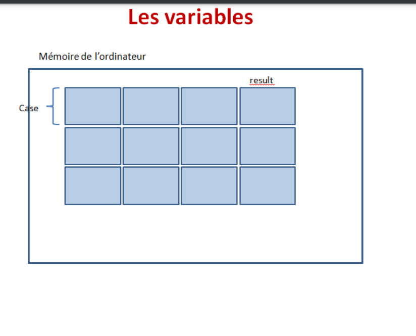

Sorte de petite boîte qui possède un nom et contient une valeur.
Comme son nom l'indique peut changer de valeur à tout moment.
Stocke différentes valeurs dans le temps, en écrasant les précédentes.
Doit être déclarée une et une seule fois dans un programme.
Il existe deux types de variables:
- **Globales**: utilisées dans tout le programme, déclarées à la base du code, en dehors de toute fonction.
- **Locales**: qui ne servent que pour un programme ou fonction particuliers, déclarées au sein de ce programme ou cette fonction.

#### Déclaration: 

Pour déclarer une variable, on utilise la syntaxe : **var ou let**.
- var ancienne syntaxe,
- let nouvelle, à privilégier.

Règle de nommage (valable pour les fonctions)= **CamelCase** :

-Suit la règle du camelCase,dans cette convention, les noms sont constitués de plusieurs mots dont l'initiale est en capitale; 
- Nom unique = **identifier**;
- Aucune ponctuation,accents,espace; 
- Mise en capitale de la première lettre des mots, sauf le premier;
- Évitez d'utiliser des abréviations ou de raccourcir des mots à chaque fois que c'est possible, même si une version plus courte semble évidente;
- Doit commencer par une lettre;
- Doit contenir uniquement des lettres, _,chiffres;
- Est sensible à la casse (Se dit de tout programme qui fait une distinction entre les lettres majuscules et les lettres minuscules, et qui ne traite donc pas de la même façon les données ou les commandes selon qu'elles sont entrées en majuscules ou en minuscules).
  
Il existe des noms « réservés » en JavaScript. Vous ne pouvez pas
utiliser ces noms comme noms pour vos variables, tout simplement car le langage JavaScript les utilise déjà pour désigner différents éléments intégrés au langage. 

Exemple: la variable prénom est déclarée ainsi: 

    let prenom;

Exemple :

    let ma PremiereVariable = "Bonjour";
    console.log(maPremiereVariable);
    

#### Initialisation:

**Initialiser**= **assigner** une valeur pour la première fois.
On utilise le signe **=**. = est un **opérateur d' affectation** ou **d' assignation** et non d' égalité, assigne voire affecte une valeur à une variable.Permet de stocker une valeur dans une variable.

Elle peut se faire:
- en même temps que la déclaration
- après la déclaration
- on peut déclarer plusieurs variables sur une ligne en les séparant par une virgule.

Exemples:

    let prenom = "paul;
->Initialisation en même temps que déclaration.

    let nom;
    nom = "paul;
->Déclaration puis initialisation.

    let titre = "chat", production = "universal", annee = 2013;
->Déclaration de plusieurs variables sur une même ligne.

#### Différence entre les mots clefs  let et var

Pourquoi possède-t-on deux mots clefs différents pour déclarer des variables en JavaScript ? Cela provient du fait qu’aucun langage n’est parfait ainsi que du fait que les langages informatiques ne sont pas figés mais sont des langages qui évoluent beaucoup et rapidement.
En même temps qu’un nouveau mot clef a été créé, les créateurs du JavaScript en ont profité pour résoudre quelques problèmes liés à la déclaration de variables en utilisant var, ce qui fait que let ne va pas nous permettre de créer des variables de la même façon
que var.
**Il existe 3 grandes différences de comportement entre les variables déclarées avec var et avec let**.

- Hoisting des variables,
- Redéclaration de variables,
- La portée des variables.
  
##### Remontée ou hoisting des variables/ 

Une variable déclarée avec var peut-être manipulée en haut de code et être déclarée en fin de code car le JS va traiter les déclarations avant le reste du code JS.Ce comportement est appelé **remontée ou hoisting**, il est dorénavant jugé inadapté.
Avec let, il faut déclarer la variable avant de l'utiliser.

Exemples:

    prenom = "paul";
    var = prenom;
->Initialisation suivi de déclaration avec var, ok.
Avec let ne fontionne pas!

    var x = 25;
    var x = 100;
->déclaration et initialisation 

var prenom = "pierre", nom = "gireaud", dpt = 83;
->déclaration plusieurs variables sur une même ligne

    var nom;
    nom = 25;
    ->déclaration sans valeur, puis initialisation (à éviter): var nom = ""; préférable affection valeur nulle à une variable.

##### La redéclaration de variable:

Avec var, il est possible de redéclarer, plusieurs fois, la même variable pour modifier sa valeur en utilisant var ( ce qui avait pour effet de modifier sa vameur).
Avec let, on ne déclare qu'une seule fois.Pour changer sa valeur, il faut lui affecter une autre valeur (La nouvelle valeur écrase la précédente), en utilisant le nom de la variable.
Pour affecter une nouvelle valeur dans une variable déjà initialisée, on va se contenter d’utiliser à nouveau l’opérateur d’affectation =.
**Il est possible de réaffecter une valeur de type différent dans une variable.**

Exemples:

    var prenom = "paul";
    var prenom = "julien";

    let prenom = "david";
    prenom = "nicolas";

    let x = 5;
    x = x + 5;
    ->On stocke dans x la valeur 5, puis dans x l'ancienne valeur de x + 5.Donc x stocke 10.

    let x = 4;
    x = "quatre";

##### La portée des variables

(voir chapitre fonction)

La « portée » d’une variable désigne l’endroit où cette variable va pouvoir être utilisée dans un script. Il est un peu tôt pour vous expliquer ce concept puisque pour bien le comprendre il faut déjà savoir ce qu’est une fonction.
Vous pouvez pour le moment retenir si vous le souhaitez que les variables déclarées avec var et celles avec let au sein d’une fonction ne vont pas avoir la même portée, c’est à-dire qu’on ne va pas pouvoir les utiliser aux mêmes endroits.

#### Quelle utilité pour les variables en pratique?

Les variables vont être à la base de la plupart de nos scripts JavaScript. En effet, il va être très pratique de stocker différents types d’informations dans les variables pour ensuite manipuler simplement ces informations notamment lorsqu’on n’a pas accès à ces
informations lorsqu’on crée le script.

Par exemple, on va pouvoir demander à des utilisateurs de nous envoyer des données grâce à la fonction (ou la méthode pour être tout à fait précis mais nous verrons cela plus tard) prompt(). Lorsqu’on écrit notre script avec notre fonction prompt(), on ne sait pas encore ce que les utilisateurs vont nous envoyer comme données. Dans ce cas, notre script va être créé de manière à ce que les données envoyées soient stockées lors de leur envoi dans des variables qu’on définit. Cela nous permet déjà de pouvoir manipuler les dites variables et par extension les données qu’elles vont stocker.

#### Les types

Les variables JavaScript vont pouvoir stocker différents types de valeurs, comme du texte ou un nombre par exemple. Par abus de langage, nous parlerons souvent de **types de variables** JavaScript.
En JavaScript, contrairement à d’autres langages de programmation, nous n’avons pas besoin de préciser à priori le type de valeur qu’une variable va pouvoir stocker. Le JavaScript va en effet automatiquement détecter quel est le type de la valeur stockée dans
telle ou telle variable, et nous allons ensuite pouvoir effectuer différentes opérations selon le type de la variable, ce qui va s’avérer très pratique pour nous !
Une conséquence directe de cela est qu’on va pouvoir stocker différents types de valeurs dans une variable au fil du temps sans se préoccuper d’une quelconque compatibilité. Par
exemple, une variable va pouvoir stocker une valeur textuelle à un moment dans un script puis un nombre à un autre moment.

##### Quelles valeurs peuvent prendre mes variables?

Le **type** d'une variable ou d'une constante est tout simplement le genre des données qu'elle enregistre.
Elles peuvent stocker différents types de valeur.
On ne stocke pas de la même façon un nombre ou une chaîne de caractères dans une variable, on effectue également pas les mêmes opérations en fonction des valeurs.

- **String** ou chaîne de caractères: une chaine de caractères est une séquence de caractères, ou ce qu’on appelle communément un texte.Texte mis entre "" ou '' ou quotes (type primitif);

        let prenom = "Pierre";
        let hello = "Bonjour, nous sommes...";
    Si l'on utilise les '', dans le cas où la chaîne de caractère contient des ', il faudra échapper avec '\' (Notez que l’antislash est considéré comme le caractère d’échappement dans de
    nombreux langages informatique):

        let dpt = "Je vis dans le \"83"\";
    Un nombre entouré de "" est considéré comme un string (cela influence les opérations effectuées):

        var d = "65";
        document.getElementById('p1').innerHTML = "Type de: + typeof nomvar; => string
- **Number**: entiers ou **integers**, réels, float (les nombres avec des chiffres après la virgule sont aussi appelés nombres en virgule flottante ou floating-point.Attention au point, pas de virgule)(type primitif);

        let x = 2.5;
        let y = -75;
        let z = 23;
- **Boolean** ou valeurs logiques: contient deux valeurs true ou false (valeurs de type booléenne).Un booléen est une valeur binaire.
Surtout utilisée pour testes, vérification de condition,...
Pour qu'une variable stocke un booléen, elle doit stocker true ou false, sans "", et sans ''(type primitif);

        let a = true;

        let resultat = 8 > 4; => l’affectation se fait en dernier et que la comparaison est faite avant.
    Lorsqu’on écrit « 8 > 4 », (qui signifie 8 strictement supérieur à 4) on demande au JavaScript d’évaluer cette comparaison. Si la comparaison est vérifiée (si elle est vraie), alors JavaScript renvoie le booléen true. Dans le cas contraire, il renvoie le booléen false. On stocke ensuite le booléen renvoyé dans la variable let resultat.
- **Tableau**: **array** en JS, il contient plusieurs valeurs classées dans un tableau. **Notez qu’en JavaScript, contrairement à d’autres langages, les tableaux sont avant tout des objets et sont des valeurs de type Object**;
- **Object**: contient des propriétés et des méthodes. Les objets sont des structures complexes qui vont pouvoir stocker plusieurs valeurs en même temps;
- **Null**: non connaissance de la valeur;

        let n = null;
- **Undefined**: ne pas avoir défini de valeur pour la variable;

        let u = undefined;
- **NaN**: not a number;

        var nn = NaN;
- **Symbol**;
  
->Les types de valeurs Null et Undefined sont des types un peu particuliers car ils ne contiennent qu’une valeur chacun : les valeurs null et undefined.
La valeur null correspond à l’absence de valeur ou du moins à l’absence de valeur connue. Pour qu’une variable contienne null, il va falloir stocker cette valeur qui représente donc l’absence de valeur de manière explicite.
La valeur null va être utile dans certains cas où on souhaite explicitement indiquer une absence de valeur connue. Il va cependant falloir qu’on ait un peu plus d’expérience avec le JavaScript pour montrer de manière pratique l’intérêt de cette valeur.
La valeur undefined correspond à une variable « non définie », c’est-à-dire une variable à laquelle on n’a pas affecté de valeur.
Cette définition peut vous paraitre similaire à celle de null et pourtant ces deux valeurs ont une signification différente.
**Si on déclare une variable sans lui attribuer de valeur, alors son type sera Undefined. Si on déclare une variable et qu’on lui passe null, alors son type sera Object**.

>JavaScript est un langage dit à types dynamiques et à typage faible. Cela signifie que vous pouvez initialiser une variable en tant que nombre, puis la réaffecter comme chaîne, ou tout autre type de variable. Ceci offre une grande souplesse, mais peut aussi conduire à un comportement inattendu si vous opérez sans précaution.

>Les types primitifs sont les briques de base de chaque structure de données en JavaScript. Peu importe la complexité finale de votre application, à sa base se trouveront ces trois types primitifs.

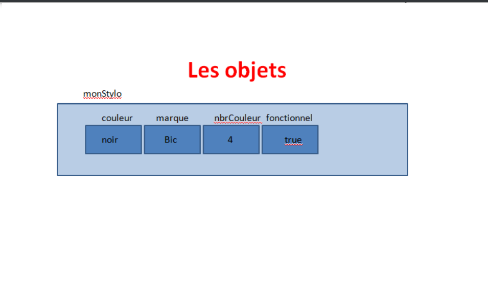

>**-> JavaScript est conçu autour d'un paradigme simple, basé sur les objets. Un objet est un ensemble de propriétés et une propriété est une association entre un nom (aussi appelé clé) et une valeur. La valeur d'une propriété peut être une fonction, auquel cas la propriété peut être appelée « méthode ». En plus des objets natifs fournis par l'environnement, il est possible de construire ses propres objets. Ce chapitre aborde la manipulation d'objets, l'utilisation des propriétés, fonctions et méthodes, il explique également comment créer ses objets**.

##### Tester type de valeur:

On utilise généralement fonction **typeof**.
Attention, renvoie parfois des valeurs contestables.

Exemple:

    alert("Variable x : " + typeof(x) +
    "\nVariable y : " + typeof(y) +
    "\nVariable a : " + typeof(a));
    ->voir main.js détails fonctions et usage.

### Présentation des opérateurs arithmétiques et d’affectation

#### Qu’est-ce qu’un opérateur ?

Un opérateur est un symbole qui va être utilisé pour effectuer certaines actions notamment sur les variables et leurs valeurs.
Il existe différents types d’opérateurs qui vont nous servir à réaliser des opérations de types différents. 
Les plus fréquemment utilisés sont :
• Les opérateurs arithmétiques ;
• Les opérateurs d’affectation / d’assignation ;
• Les opérateurs de comparaison ;
• Les opérateurs d’incrémentation et décrémentation ;
• Les opérateurs logiques ;
• L’opérateur de concaténation ;
• L’opérateur ternaire ;
• l’opérateur virgule.

#### Les opérateurs arithmétiques : Calculs sur variables

Il est possible de faire des calculs sur des variables de type number contenues dans différentes variables:

|Opération|Symbole|
|:-------|:------|
|Addition|+|
|Soustraction|-|
|Multiplication|*|
|Division|/|
|Modulo (entier reste division euclidienne)|%|
|Exponentielle (élévation à la puissance d’un nombre par un autre)| **|
|Incrémenter var de 1, puis affecte le résultat|++|
|Décrementer var de 1, puis affecte le résultat|--|

Exemples:

    let x = 6;
    let y = 7;
    let addition = x + y;

    let x = 5;
    x = x + 5; (10)
    x = x + 3; (13)

    var mod = 13 % 3;

    let g = x ** 3; => g stocke 2^3 = 2*2*2 = 8

    let cookiesInJar = 10;
    cookiesInJar -= 2;  //il reste 8 cookies
    cookiesInJar += 12; // il y a maintenant 20 cookies dans la boîte
**Attention à bien respecter les priorités de calcul comme en mathématiques!**

#### Les opérateurs d’affectation

Les opérateurs d’affectation vont nous permettre, comme leur nom l’indique, d’affecter une certaine valeur à une variable.
Nous connaissons déjà bien l’opérateur d’affectation le plus utilisé qui est le signe =.
Cependant, vous devez également savoir qu’il existe également des opérateurs «
combinés » qui vont effectuer une opération d’un certain type (comme une opération arithmétique par exemple) et affecter en même temps.

|Définition|Opérateur|
|:----------|:--------|
|Incrémenter une var de la valeur d'une seconde var, puis affecte le résultat|+=|
|Décrémenter une var de la valeur d'une seconde var, puis affecte le résultat|-=|
|Multiplier l'ancienne valeur de la variable, puis affecte le résultat| *=|
|Diviser l'ancienne valeur de la variable, puis affecte le résultat| /=|
|Modulo l'ancienne valeur de la variable, puis affecte le résultat| %=|

Exemples:

   var x =2;
    x += 2; => x = x+2;
    x -= 3; => x = x-3;

    y *= x; => y = y*x;
Ici, vous devez bien comprendre que les opérateurs d’affectation combinés nous
permettent d’effectuer deux types d’opérations à la suite. Dans l’exemple ci-dessus, on réalise des opérations arithmétiques puis d’affectation.

#### Les opérateurs d' incrémentation et de décrémentation 

Incrémenter une valeur signifie ajouter 1 à cette valeur tandis que décrémenter signifie enlever 1.

**A retenir**: il y a deux façons d’incrémenter ou de décrémenter une variable : 
on peut soit incrémenter / décrémenter la valeur de la variable puis retourner la valeur de la variable incrémentée ou décrémentée (on parle alors de pré-incrémentation et de prédécrémentation), soit retourner la valeur de la variable avant incrémentation ou
décrémentation puis ensuite l’incrémenter ou la décrémenter (on parle alors de postincrémentation et de post-décrémentation).

>Cette différence d’ordre de traitement des opérations va influer sur le résultat de nombreux codes et notamment lorsqu’on voudra en même temps incrémenter ou décrémenter la valeur d’une variable et l’afficher ou la manipuler d’une quelconque façon. Tenez-en donc
bien compte à chaque fois que vous utilisez les opérateurs d’incrémentation ou de décrémentation.

|Exemple (opérateur variable| Résultat|
|:----------------|:-----------------|
| ++x |Pré-incrémentation : incrémente la valeur contenue dans la variable x, puis retourne la valeur incrémentée|
| x++|Post-incrémentation : retourne la valeur contenue dans x avant incrémentation, puis incrémente la valeur de $x|
| --x|Pré-décrémentation : décrémente la valeur contenue dans lavariable x, puis retourne la valeur décrémentée|
| x--|Post-décrémentation : retourne la valeur contenue dans x avant décrémentation, puis décrémente la valeur de $x|

Exemples:

    let a = 10, b= 10, c = 20, d = 20;

    document.getElementById("p1").innerHTML = "a stocke la valeur " + a++; =>
    document.getElementById("p2").innerHTML = "b stocke la valeur " + ++b;
    document.getElementById("p3").innerHTML = "c stocke la valeur " + c--;
    document.getElementById("p4").innerHTML = "d stocke la valeur " + --d;

    Réaffichage du contenu des variables:
    document.getElementById('p5').innerHTML = 'a = ' + a +...
    => a stocke la valeur de 10, b stocke la valeur 11, c stocke la valeur de 20, d stocke la valeur de 19
    =>a= 11, b = 11,c = 19, d = 19

#### Concaténation et littéraux de gabarits (template literals ou template strings)

##### Concaténation

Consiste en l' assemblage de texte et de variable (addition de chaîne de caractères).
On utilise le signe "**+**", utilisé également pour additionner, JS fait la différence en fonction du type de valeurs qui entourent le +.
**S'il s' agit de nombres: addition, s'il s'agit de textes : concatène**.
Notez une chose intéressante relative à la concaténation en JavaScript ici : **si on utilise l’opérateur + pour concaténer une chaine de caractères puis un nombre, alors le JavaScript va considérer le nombre comme une chaine de caractères**.

Exemples:

    let nom = "chat";
    let prenom = "bahamut";
    console.log(nom + prenom);
    ->affichage : chatbahamut
               
                   Attention aux espaces!

    let nom = "chat ";
    ->espace après le nom => affichage : chat bahamut

    let prenom = "anne-so", espace = "", nom = "vand";
    let moi = prenom + espace + nom;
    ->concaténation de variable

    let moi = "anneso" + " " + "paul";
    ->concaténation de valeur

    let sport = "courir";
    let hobby = "j' aime le" + " " + sport;

    alert("Bonjour" + \nsport);

    let x = 4 + 2 + "1"; => 4 et 2 s'additionne (les deux **opérandes**, éléments à gauche et droite de l' opérateur) puis concaténation avec 1: 61.
    let y = "1" + 2 + 4; => 124.
    let z = 2 + "un" + 4; => 2un4.
    ->distinction + addition et + concaténation.Addition nombre et chaîne de caractère, tout ce qui sera après la chaîne de caractère sera considéré commme une chapine de caractère = > pas d'addition mais concaténation!
    
    alert("variable x :" + typeof(x)); => string.

##### Littéraux de gabarits 

On a vu plus tôt dans ce cours qu’il fallait en JavaScript toujours entourer nos chaines de caractères (nos textes) avec des apostrophes ou des guillemets droits.
Il existe en fait une troisième manière introduite récemment d’entourer des chaines de caractères en JavaScript qui va utiliser **des accents graves `**.
**La grande différence entre l’utilisation d’accents graves ou l’utilisation d’apostrophes ou de guillemets est que toute expression placée entre les accents graves va être interprétée en JavaScript. Pour le dire simplement : tout ce qui renvoie une valeur va être remplacé par sa valeur. Cela signifie notamment qu’on va pouvoir placer du texte et des variables ensemble sans avoir besoin d’utiliser d’opérateur de concaténation puisque les variables vont être interprétées, c’est-à-dire remplacées par leur valeur. Pour que cela fonctionne bien, il va cependant falloir respecter une certaine syntaxe : il va falloir placer les expressions entre ${ et }**.

<la **string interpolation** Pour créer une string interpolation on écrit du texte encadrée par le signe  `  et si on veut injecter une variable dans ce code on utilise l’expression  ${maVariable}. >

Exemples:

    let x= 5;
    let y = 50;
    alert("x contient " + x + "\ny contient " + y + \nLeur valeur somme vaut " + (x +y));
    =>
    alert(`x contient ${x} 
        y contient ${y} 
        Leur valeur somme vaut ${x +y}`);
**Notez également que l’utilisation des littéraux de gabarits conserve les retours à la ligne et les décalages dans le résultat final**.

### Constante

Dans de nombreux programmes, certaines données ne seront pas modifiées pendant l'exécution du programme. 
Pour s'assurer de ne pas réaffecter par inadvertance de nouvelles valeurs à ces données, vous allez utiliser des **constantes**.
Ce sont simplement des variables qui ne seront pas mutables. On donnera une valeur de départ et on ne pourra plus changer la valeur par la suite. Ainsi s’il y a une erreur de logique dans votre code changeant la valeur du variable (constante) qui ne devait pas changer, javascript retournera une erreur.
Pour créer ou déclarer une cosntante en JS, il faut utiliser le mot clef : **const**.
On la déclare de la même façon que let.
**Il faut obligatoirement l' initialiser lors de sa déclaration sinon une erreur sera retournée**.
**Valeur inchangeable**.

Exemple:

    const x = 5;

### Les tableaux : l'objet array

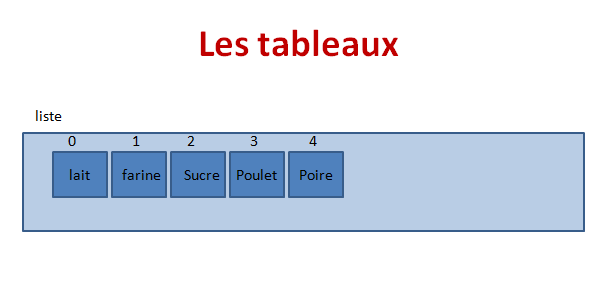

#### Les propriétés

|Propriété|Description|
|:--------|:----------|
|lenght|contient le nombre d' éléments du tableau|
|input|permet de faire une recherche dans le tableau à l'aide d'un expression régulière|
|prototype|permet d' ajouter des propriétés personnalisées à l'objet|

#### Les méthodes standards

|Méthode|Description|
|:--------|:----------|
|concat(tab1,tab2[,tab3,...])|permet de concaténer plusieurs tableaux, créer un tableau à partir de plusieurs tableaux|
|tableau.join(",")|renvoie une chaîne de caractères contenant tous les éléments du tableau séparé par le séparateur mis en paramètre : vat tab=newArray("pommes","poires")document.write(tab.join(",")renvoie pommes,poires)|
|tableau.pop()|supprime le dernier élément du tableau et retourne sa valeur|
|tableau.shift()|supprime le premier élément du tableau |
|tableau.push(valeur1,valeur2,...)|ajoute un ou plusieurs éléments  en fin de tableau et retourne la nouvelle taille du tableau|
|tableau.unshift()|supprime le premier élément du tableau|
|tableau.splice(debut,nbr_elements,"new_1","new-2")|Ajoute/retire des éléments d'un tableau en fonction de la position indiqué.Paramètres: **début**L'indice à partir duquel commencer à changer le tableau (l'indice du premier élement étant 0). Si sa valeur est supérieure à la longueur du tableau array.length, début est ramené à la longueur du tableau array.length. S'il est négatif, le changement commencera d'autant d'éléments à partir de la fin du tableau, c'est à dire à partir de l'index array.length + début. Si array.length + début est inférieur à 0, le changement commencera à l'index 0.**nbASupprimer**Un entier indiquant le nombre d'anciens éléments à remplacer. Si ce paramètre est absent ou si sa valeur est supérieure ou égale à array.length - début, alors les éléments entre début et la fin du tableau seront supprimés. Si nbASupprimer vaut 0, aucun élément ne sera supprimé. Dans ce cas, il est nécessaire de spécifier au moins un nouvel élément.**élemN**Les éléments à ajouter au tableau à partir de début. Si vous ne spécifiez pas de nouvel élément, les anciens éléments seront simplement supprimés du tableau.|
|tableau.slice(debut,fin)|Renvoie un tableau contenant une partie extraction) des éléments d'un tableau.Le paramètre fin est exclu|
|Tableau.sort() |trie les éléments d'un tableau.|
|Tableau.includes(valeur recherché,position)|Permet de savoir si un élément se trouve dans un le tableau elle recoit en paramètre l'element recherché et la position dans le tableau a partir de laquelle la recherche commence, elle retourne true ou false.|
|Tableau.toString()|Renvoie la chaîne de caractères correspond à l'instruction qui a permis de créer l'objet Array|
|Tableau.indexOf(valeur,position) |Retourne la position de l'élément mis en paramètre la recherche commence en fonction du deuxième paramètre si ce deuxième paramètre est omis la recherche commence en début de tableau si l'élément n'est pas trouvé elle retourne -1.|
|Tableau.lastIndexOf(valeur,position)|similaire a indexOf la recherche se faisant à partir de la dernière position.|
|Tableau.valueOf |Retourne tout simplement la valeur de l'objet Array auquel elle fait référence.|
|Tableau.reverse()|Inverse l'ordre des éléments du tableau|

Exemples :

    let array3 = ["Javascript", "Php", "Python"];
    let array4 = ["Ruby", "Solidity"];

concat():

    let newArray = array3.concat(array4);

join() :  

    console.log(array3.join(' -> '));
->Javascript -> Php -> Python

    console.log(array3.join(' '));
->Javascript Php Python

.slice():

    console.log(array3.slice(1));
    ["Php", "Python"]
->l’extraction commence à l’index 1 jusqu’au dernier index inclus

    console.log(newArray.slice(1, 4));
->l’extraction commence à l’index 1 et
s’arrete à l’index 4 (index 4 exclu)

.indexOf() et .forEach():

    console.log(array3.indexOf("Python"));
->donne l’index de « python » soit 2

    array3.forEach((languages) => console.log(languages));
->applique un forEach au tableau 3 et renvoi les valeurs de
chaque index

.every() et .some():

    console.log(array3.every((language) => language == "Php"));
->renvoie false car tous les index ne sont pas « php »

    console.log(array3.some((language) => language == "Php"));
->renvoie true car aux moins un index contient « php »

.shift():

    let shift = array3.shift();
->supprime le premier element du tableau

.pop():

    console.log(array3.pop());
->supprime le dernier element du tableau et renvoie sa valeur

.splice():
.splice(index de depart, nb à supprimer, element à ajouter)

    var mesPoissons = ["scalaire", "clown","mandarin","chirurgien"]; 

    var enleves = mesPoissons.splice(2, 0, "tambour");
    // supprime 0 élément à partir de l'index 2, et insère "tambour"
    // mesPoissons est ["scalaire", "clown", "tambour", "mandarin", "chirurgien"]
    // enleves est 0, aucun élément supprimé

    enleves = mesPoissons.splice(3, 1);
    // supprime 1 élément à partir de l'index 3
    // mesPoissons est ["scalaire", "clown", "tambour","chirurgien"]
    // enleves est ["mandarin"]
    
    enleves = mesPoissons.splice(2, 1, "trompette");
    // supprime 1 élément à partir de l'index 2, et insère "trompette"

    enleves = mesPoissons.splice(0, 2, "perroquet", "anémone", "bleu");
    // mesPoissons est ["perroquet", "anémone", "bleu", "trompette", "chirurgien"]
    // enleves est ["scalaire", "clown"]

    enleves = mesPoissons.splice(mesPoissons.length - 3, 2);
    // supprime 2 éléments à partir de l'indice 2
    // mesPoissons est ["perroquet", "anémone","chirurgien"]
    // enleves est ["bleu", "trompette"]

    var mesPoissons = ["perroquet", "anémone", "bleu", "trompette", "chirurgien"];
    enleves = mesPoissons.splice(2);
    // on retire les éléments à partir de l'indice 2
    // mesPoissons vaut ["perroquet", "anémone"]
    // enleves vaut ["bleu", "trompette", "chirurgien"]

    var mesAnimaux = ["cheval", "chien", "chat", "dauphin"];
    enleves = mesAnimaux.splice(-2, 1);
    // mesAnimaux vaut ["cheval", "chien", "dauphin"]
    // enleves vaut ["chat"]

.reduce():
Reduce permet de calculer toutes les valeurs du tableau

   let arrayNumber = [4, 74, 28, 12, 1];
    arrayNumber.reduce((x, y) => x + y);
->donne 119
 
filter():
permet de filtrer les éléments d’un tableau

    let arrayNumber = [4, 74, 28, 12, 1, 17 , 8];
    arrayNumber.filter((number) => number > 10);
->donne (4) [74, 28, 12, 17]

sort():
permet de trier les éléments d’un tableau

    arrayNumber.sort();
sans autre précision la méthode tri selon la dizaine ce qui donne :
->(7) [1, 12, 17, 28, 4, 74, 8]

    arrayNumber.sort((a, b) => a - b);
->en passant deux paramètres a et b et en indiquant a – b , le tri se fera
par ordre croissant
(7) [1, 4, 8, 12, 17, 28, 74]

  arrayNumber.sort((a, b) => b - a);
->en passant deux paramètres a et b et en indiquant b – a , le tri se fera
par ordre décroissant
(7) [74, 28, 17, 12, 8, 4, 1]

## Structures de contrôle, conditions et opérateurs de comparaison JavaScript

On appelle « structure de contrôle » un ensemble d’instructions qui permet de contrôler l’exécution du code.
Il existe deux grands types de structure de contrôle de base qu’on retrouve dans la plupart des langages informatiques et notamment en JavaScript : **les structures de contrôle conditionnelles (ou plus simplement les « conditions ») et les structures de contrôle de boucles (ou plus simplement les « boucles »)**.
- Les conditions vont nous permettre d’exécuter un certain nombre d’instructions si et seulement si une certaine condition est vérifiée.
- Les boucles vont nous permettre d’exécuter un bloc de code en boucle tant qu’une condition donnée est vérifiée.

### Les boucles

Faire répèter à l'ordinateur une série d'instructions tant qu'une condition est respectée.
Les boucles vont nous permettre d’exécuter plusieurs fois un bloc de code, c’est-à-dire d’exécuter un code « en boucle » tant qu’une condition donnée est vérifiée et donc ainsi nous faire gagner beaucoup de temps dans l’écriture de nos scripts.
Lorsqu’on code, on va en effet souvent devoir exécuter plusieurs fois un même code.
Utiliser une boucle nous permet de n’écrire le code qu’on doit exécuter plusieurs fois qu’une seule fois.

Nous disposons de six boucles différentes en JavaScript :

• La boucle while (« tant que ») ;
• La boucle do… while (« faire… tant que ») ;
• La boucle for (« pour ») ;
• La boucle for… in (« pour… dans») ;
• La boucle for… of (« pour… parmi ») ;
• La boucle for await… of (« pour -en attente-… parmi »).

Le fonctionnement général des boucles est toujours le même : on pose une condition qui sera généralement liée à la valeur d’une variable et on exécute le code de la boucle « en boucle » tant que la condition est vérifiée.
Pour éviter de rester bloqué à l’infini dans une boucle, vous pouvez donc déjà noter qu’il faudra que la condition donnée soit fausse à un moment donné (pour pouvoir sortir de la boucle).
**Pour que notre condition devienne fausse à un moment, on pourra par exemple incrémenter ou décrémenter la valeur de notre variable à chaque nouveau passage dans la boucle (ou modifier la valeur de notre variable selon un certain schéma)**.

Les boucles vont donc être essentiellement composées de trois choses:

• Une valeur de départ qui va nous servir à initialiser notre boucle et nous servir de compteur ;
• Un test ou une condition de sortie qui précise le critère de sortie de la boucle ;
• Un itérateur qui va modifier la valeur de départ de la boucle à chaque nouveau passage jusqu’au moment où la condition de sortie est vérifiée. Bien souvent, on incrémentera la valeur de départ

#### While

La boucle while (« tant que » en français) va nous permettre de répéter une série d’instructions tant qu’une condition donnée est vraie c’est-à-dire tant que la condition de sortie n’est pas vérifiée.

Exemple:
Demander à l'user de saisir son âge

    let age = window.prompt("Quel est votre âge?");

    while (isNaN(age)) {
        age = window.prompt("Merci de répondre un nombre. Quel est votre âge?);
    }

    console.log("vous avez " + age + " ans.");
    ->Age demandé, puis :
    "tant que l' âge n'est pas un nombre (is NaN),alors on demande l'âge de nouveau.
    La boucle ne s'arrêtera qu'une fois que la condition, dans parenthèse du while, n'est plus respectée : âge sera un nombre.

Exemple :
Exécuter la boucle un nombre défini de fois.

    let cpt = 0;

    while(cpt<=20){
        cpt++;
        console.log(cpt);
    }
    ->La boucle s' exécute tant que le compteur est plus petit que 20.On incrémente le compteur de 1 à chaque tour.

**Attention à bien penser à incrémenter,sion boucle infinie!**.

#### do… while

La boucle do… while (« faire… tant que ») est relativement semblable à la boucle while dans sa syntaxe.
La grande différence entre les boucles while et do… while va résider dans l’ordre dans lequel vont se faire les opérations.
**En effet, lorsqu’on utilise une boucle do… while, le code de la boucle va être exécuté avant l’évaluation de la condition de sortie**. Cela signifie qu’à la différence de la boucle while, on effectuera toujours un passage dans une boucle do… while même si la condition de sortie n’est jamais vérifiée et donc le code de la boucle sera toujours exécuté au moins une fois.

Exemple:

    do{
        docuement.getElementById("p2").innerHTML +=
        "a stocke la valeur" + a + "lor du passage n°" + (a + 1) + "dans la boucle ";
        a++;
    }
    while(a<10);

**Il va donc être intéressant d’utiliser une boucle do… while plutôt qu’on boucle while lorsque notre script a besoin que le code dans notre boucle s’exécute au moins une fois pour fonctionner**.

#### For

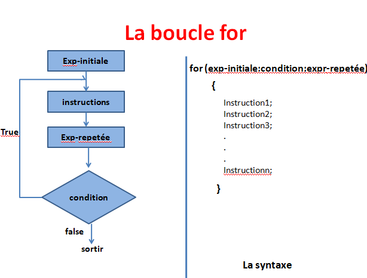

La boucle for (« pour » en français) est structurellement différente des boucles while et do… while puisqu’on va cette fois-ci initialiser notre variable à l’intérieur de la boucle.
La boucle for utilise une syntaxe relativement condensée et est relativement puissante ce qui en fait la condition la plus utilisée en JavaScript.

Cette boucle est un peu particulière, elle a dans ses paramètres un **index, une condition,et une incrémentation**.
C'est la boucle utilisée pour parcourir un tableau bien souvent.
Une boucle for contient trois « phases » à l’intérieur du couple de parenthèses : une phase d’initialisation, une phase de test (condition de sortie) et une phase d’itération (généralement une incrémentation). Chaque phase est séparée des autres par un pointvirgule.

Exemple:

    for(let i=0; i<liste.lenght ; i++){
        console.log(liste[i]);
    }
    ->initialisation : let i=0 = initialisation de l'index qui va être incrémenté.
    ->condition : i<liste.lenght = condition qui doit être respectée pour que la boucle continue.
    ->incrémentation : i++ = incrémentaiton de l'index.
    Cette boucle passe par chaque case du tableau liste et afficher ce qu'il contient en console.

>Notez qu’on utilise généralement la lettre **« i »** (pour « iterator ») dans les boucles en  général et particulièrement au sein des boucles for pour les reconnaitre plus rapidement  dans un script. Cependant, ce n’est pas obligatoire et vous pouvez utiliser n’importe quel  autre nom de variable.
#### Utiliser une instruction continue pour passer directement à l’itération suivante d’une boucle

Pour sauter une itération de boucle et passer directement à la suivante, on peut utiliser une **instruction continue**. Cette nstruction va nous permettre de sauter l’itération actuelle
et de passer directement à l’itération suivante.

Cette instruction peut s’avérer très utile pour optimiser les performances d’une boucle et économiser les ressources lorsqu’on utilise une boucle pour rechercher spécifiquement certaines valeurs qui répondent à des critères précis.

Exemple:
On pourrait imaginer qu’on ne souhaite afficher de message que pour les valeurs paires de let i. On va donc utiliser une
instruction continue pour passer directement à l’itération suivante si let i contient une valeur impaire.

    for(let = 0; i < 10; i++){
        if(i % 2 != 0){
            continue;
        }
        document.getElementById("p1").innerHTML += txt;
    }
    ->le += permet de rajouter au p1 le txt

Cette instruction continue va indiquer au JavaScript qu’il doit sauter l’itération de boucle actuelle et passer immédiatement à la suivante.

#### Utiliser une instruction break pour sortir prématurément d’une boucle

On va également pouvoir complètement stopper l’exécution d’une boucle et sortir à un moment donné en utilisant une instruction break au sein de la boucle.
Utiliser cette instruction peut à nouveau s’avérer très intéressant pour optimiser les performances de notre script lorsqu’on utilise une boucle pour chercher une valeur en particulier en itérant parmi un grand nombre de valeurs.

#### Portée de la variable ou scope:

Dans l'exemple précédent nous déclarons la variable i dans la boucle for.Les variables déclarées avec let ne sont utilisables que dans la structure dans laquelle elles sont déclarées.

Exemple:

    for(let i=0; i<liste.lenght ; i++){
        console.log(liste[i]);
    }
    console.log(i);
->console va retourner une erreur! "i is not defined"
**Elle ne connaît pas i car déclarée dans for donc non utilisable en dehors.**
**Valable pour tous les blocs, if, while,...**

#### Les boucles for… in, for… of et for await…of

Les boucles for… in, for… of et for await…of vont être utilisées pour parcourir des objets. 

### Les conditions

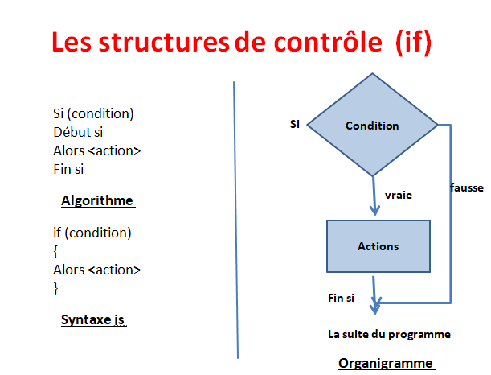

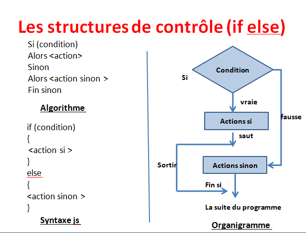

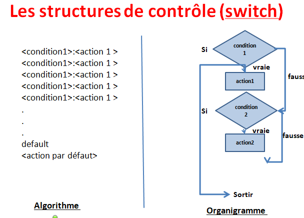

Structures de contrôle, qui permettent de contrôler les instructions en fonction de l'évolution du programme.
Permet d' effectuer des actions en fonction de paramètres, afin de dynamiser le site et ajouter des intéractions.

Une condition est un test que va effectuer le programme, et nous allons lui indiquer ce qu'il doit faire si cette condition est vraie,ou faire si fausse.
• La condition if (si) ;
• La condition if… else (si… sinon) ;
• La condition if… elseif… else (si… sinon si… sinon).

#### Comment JavaScript compare différentes valeurs?

Le JS saît comparer différentes valeurs entre elles. A chaque fois que l'on compare différentes valeurs, le JS renvoie un booléen:  soit valeur true ou soit false.
**Pour bien utiliser les opérateurs de comparaison et comprendre tout leur intérêt, vous devez bien vous rappeler que lorsqu’on utilise un opérateur de comparaison, le JavaScript va automatiquement comparer la valeur à gauche de l’opérateur à celle à droite selon l’opérateur de comparaison fourni et renvoyer le booléen true si la comparaison est validée ou false si elle ne l’est pas.
Il est essentiel de bien comprendre cela car nos conditions vont s’appuyer sur cette valeur booléenne pour décider si un code doit être exécuté ou pas**.

Exemples:

Si l'user a plus de 18 ans, on va lui dire qu'il est majeur, sinon, on lui dira qu'il est mineur.

    let age = window.prompt("Quel âge avez-vous?");
    console.log(age);

    age = parseInt(age);
    ->on parse l' age pour le considérer comme un nombre.

    if(age === 18){
        console.log("vous êtes majeur);
    }
    else{
        console.log("vous êtes mineur");
    }
    ->dans ce cas, si age=19, le programme nous dira que nous sommes mineur,il faut utiliser un autre opérateur(=== sécurité pour nombre, pas de parse si == mais risque de NaN).

    var x = 7, y = 14;
    var vrai = x < y;
    var faux = 14 <= 7;
    var egalVal = 4 == "4"; => true
    var egalVaType = 4 === "4"; => false
    var difValType = 4 !== "4"; => true

Pour effectuer un test à l' intérieur d'une condition, nous aurons besoin d' **opérateurs de comparaison**.

#### Les opérateurs de comparaison

Voici les différents opérateurs possibles pour effectuer une comparaison entre deux variables :

|Opérateurs|Signification|
|:------|:------|
|==|égal à (en valeur)|
|!=|différent de (en valeur)|
|===|strictement égal à (en valeur ou en type)|
|!==|strictement différent (en valeur ou en type)|
|>|valeur strictement supérieur|
|>=|supérieur ou égal|
|<|valeur strictement inférieur|
|<=|inférieur ou égal|
|<>|permet également de tester la différence en valeurs|

La première chose à bien comprendre ici est que les opérateurs de comparaison ne nous servent pas à indiquer au JavaScript que tel opérande est supérieur, égal, ou inférieure à tel autre opérande.
>Note : les opérandes sont les valeurs de chaque côté d’un opérateur.

Au contraire, lorsqu’on utilise un opérateur de comparaison on demande au JavaScript de  comparer les deux opérandes selon l’opérateur choisi (on parle également « d’évaluer » la comparaison) et de nous dire si cette comparaison est vérifiée (c’est-à-dire si elle est vraie d’un point de vue mathématique) ou pas.
**Dans le cas où la comparaison est vérifiée, le JavaScript renvoie le booléen true. Dans le cas contraire, le booléen false est renvoyé**.
**Revenons à nos opérateurs. Tout d’abord, notez que notre « égal » mathématique
(l’égalité en termes de valeurs) se traduit en JavaScript par le double signe égal ==**.
Ensuite, certains d’entre vous doivent certainement se demander ce que signifie le triple égal. Lorsqu’on utilise **un triple égal ===, on cherche à effectuer une comparaison non seulement sur la valeur mais également sur le type des deux opérandes**.

Exemples:

    4 == "4" => true car même valeur.
    4 === "4" => false, valeur ok mais type différents.

#### Les conditions : If Else

Structure conditionnelle qui va permettre de tester une condition et de réaliser des instructions différentes selon qu'elle est vraie ou fausse.
La condition if est l’une des conditions les plus utilisées et est également la plus simple à appréhender puisqu’elle va juste nous permettre d’exécuter un bloc de code si et seulement si le résultat d’un test vaut true.
>Comparaison = test

La condition if est une structure conditionnelle limitée par définition puisqu’elle ne nous permet d’exécuter un bloc de code que dans le cas où le résultat d’un test est évalué à true mais elle ne nous offre aucun support dans le cas contraire.
La structure conditionnelle if…else (« si… sinon » en français) va être plus complète que la condition if puisqu’elle va nous permettre d’exécuter un premier bloc de code si un test renvoie true ou un autre bloc de code dans le cas contraire.
Notez la syntaxe de la condition if…else : on place notre comparaison et on effectue notre test dans le if mais dans aucun cas on ne mentionne de test dans le else.
Si le test de notre condition est validé, le code dans le if va s’exécuter et le code dans le else va alors être ignoré.

La condition if…else if…else (« si…sinon si…sinon ») est une structure conditionnelle encore plus complète que la condition if…else puisqu’elle va nous permettre cette fois-ci de générer et de prendre en charge autant de cas que l’on souhaite.
En effet, nous allons pouvoir écrire autant de else if que l’on veut dans notre
condition if…else if…else et chaque else if va posséder son propre test.

    if(condition){
        instruction si vraie;
    }
    else{
        instruction si fausse;
    };

    var heure = 18;
    if(heure <= 20 == true){
        alert("Bonjour");
    };
    ->comparaison (ou le « test ») 18 à 20=>envoie valeur true ou false puis si JS renvoie bien true ( == true)=> exécution alert

    if(typeof(heure) == "number" == true){
        alert("c'est le matin");
    } => true
Le programme effectuera les instructions présentes entre les accolades du if si la condition entre parenthèse retourne true,inon du else si retourne false.

Else non obligatoire.

L'on peut enchaîner les if:

    if(age >= 100){
        console.log();
    }
    else if(age >= 18){
        console.log();
    }
    else{
        console.log();
    }
**vous devez savoir que toute valeur évaluée par le JavaScript dans un contexte booléen va être évaluée à true à l’exception des valeurs suivantes qui vont être évaluées à false**:

• Le booléen false ;
• La valeur 0 ;
• Une chaine de caractères vide ;
• La valeur null ;
• La valeur undefined ;
• La valeur NaN (« Not a Number » = « n’est pas un nombre »).

#### Inverser la valeur logique d’un test

Dans les exemples ci-dessus, le code placé dans notre condition n’est exécuté que si le résultat de la comparaison est true.
Dans certaines situations, nous préférerons créer nos conditions de telle sorte à ce que le code dans la condition soit exécuté si le résultat de la comparaison est false.
Nous allons pouvoir faire cela de deux manières : soit en utilisant l’opérateur logique inverse ! que nous étudierons dans la leçon suivante, soit en comparant explicitement le résultat de notre comparaison à false.
Pour inverser la valeur logique d’un test, c’est-à-dire pour exécuter le code de la condition uniquement lorsque notre première comparaison est évaluée à false, il suffit donc de comparer le résultat de cette première comparaison à la valeur false.
Si notre première comparaison n’est pas vérifiée et est évaluée à false, alors le test de notre condition va devenir if(false == false) ce qui va être finalement évalué à true et donc le code de notre condition va bien être exécuté !
Ici, je vous conseille d’utiliser les parenthèses pour être certain de l’ordre dans lequel les différentes opérations vont se faire. Cela évite d’avoir à se soucier de l’ordre de traitement des différents opérateurs. En effet, en utilisant les parenthèses, on peut « forcer » l’ordre des opérations afin que la comparaison de base se fasse bien en premier pour ensuite pouvoir comparer son résultat à false.

Exemple:

    let x = 4;
    let y = 0;

    if((x > 1) == false){
        instruction;
    };
    ->Dans ces exemples, le JavaScript commence par évaluer les comparaisons entre parenthèses et renvoie true ou false. Ensuite, on compare le résultat renvoyé par JavaScript à false. Dans le cas où JavaScript a évalué la comparaison de base à false, on a donc false == false ce qui est évalué à true puisque c’est bien le cas et on exécute le code de la condition.

### Conditions multiples, opérateurs logiques, précédence et règles d’associativité des opérateurs en JavaScript

Les conditions dans les structure de contrôle peuvent être multiples.
C'est là qu'interviennent les **ET, OU et CONTRAIRE ou NON**.
Cela permet d' effectuer plusieurs comparaisons.
**Ce type d’opérateurs va nous permettre d’effectuer plusieurs comparaisons dans nos conditions ou d’inverser la valeur logique du résultat d’un test.
Nous parlerons également de précédence et d’associativité des opérateurs, c’est-à-dire de l’ordre et de la façon selon lesquels le JavaScript va traiter les opérateurs**.

->Les opérateurs logiques sont des opérateurs qui vont principalement être utilisés avec des valeurs booléennes et au sein de conditions.

Le JavaScript supporte trois opérateurs logiques : l’opérateur logique « ET », l’opérateur logique « OU » et l’opérateur logique « NON ».
Les opérateurs logiques « ET » et « OU » vont nous permettre d’effectuer plusieurs comparaisons dans une condition. Si on utilise l’opérateur « ET », toutes les comparaisons devront être évaluées à true pour que le test global de la condition retourne true. Dans le cas où n utilise l’opérateur logique « OU », il suffira qu’une seule des comparaisons soit évaluée à true pour exécuter le code dans la condition.
Finalement, l’opérateur logique « NON » va nous permettre d’inverser le résultat logique d’un test dans une condition, ce qui signifie que ce qui a été évalué à true renverra false avec l’opérateur logique « NON » et inversement pour ce qui a été évalué à false.

#### &&  AND

Permet d' avoir un intervalle de comparaison pour une variable.
Lorsqu’il est utilisé avec des valeurs booléennes, renvoie true si toutes les comparaisons sont évaluées à true ou false sinon.

Exemple:

    let prenom = "paul";
    if(age >= 100 && prenom === "paul"){
        console.log("Bonjour paul");
    };
**&& = et**: Il faut que les deux conditions retournent true pour que les instructions puissent être exécutées.

#### || OR

Lorsqu’il est utilisé avec des valeurs booléennes, renvoie true si au moins l’une des comparaisons est évaluée à true ou false sinon.

    let prenom = "paul";
    if(age >= 100 || prenom === "paul"){
        ;
    };
**|| = ou**: Il faut que l'une des deux conditions retourne true pour l'exécution.

#### Contraire, NON

Permet de lier le résultat des comparaisons, ainsi les comparaisons évaluées de base à false, vont être évaluée à true et inversement.
Renvoie false si une comparaison est évaluée à true ou renvoie true dans le cas contraire.

Exemple :

    let heure = 18;
    if(!(heure <= 16) == true ){
        alert("il est plus de 16h");
    };
    ->on lie le résultat envoyé par Js, qui est: false car 18>16, on lie donc, le résultat renvoyé devient true => true = true

#### Précédence et règles d’associativité des opérateurs

Vous pouvez noter que j’ai dans ma troisième condition utilisé un deuxième couple de parenthèses pour être sûr que l’opérateur ! porte bien sur le résultat de la comparaison x <= 2 et non pas seulement sur x, ce qui produirait un résultat différent.
**Pour comprendre cela, il faut savoir que les différents opérateurs de chaque type ont une priorité de traitement différente. Cela signifie que le JavaScript va d’abord traiter tel opérateur, puis tel autre et etc**
Cet ordre de priorité est appelé **« précédence »**. En plus de cela, vous devez également savoir que les opérateurs vont avoir différents **sens d’associativité**.

L’associativité détermine l’ordre dans lequel des opérateurs de même précédence sont évalués et va pouvoir se faire par la droite ou par la gauche. Une associativité par la gauche signifie qu’on va commencer réaliser les opérations en partant de la gauche et vers la droite tandis qu’une associativité par la droite signifie qu’on va commencer par la droite.

Voici un tableau classant les
différents opérateurs vus jusqu’à présent (et quelques autres que nous allons voir très vite) de la plus haute (0) à la plus basse précédence (10), c’est-à-dire selon leur ordre de traitement par le JavaScript.
Les opérateurs ayant le même chiffre de précédence vont être traités selon la même priorité par le JavaScript et il faudra alors regarder leur associativité qui est également précisée. Lorsque l’associativité est « gauche » dans la tableau ci-dessous, cela signifie de gauche vers la droite et inversement pour « droite ».

|Précédence |Opérateur (nom)|Opérateur (symbole) |Associativité |
|:---------|:---------|:---------|:---------|
|0|Groupement|(...)|non applicable|
|1|Post-incrémentaion|...++|non applicable|
|1|Post-décrementation|...-|non applicable|
|2|NON (logique)|!...|droite|
|2|Pré-incrémentation|++...|droite|
|2|Pré-décrémentation|--...|droite|
|3|Exponentiel|...**...|droite|
|3|Multiplication|...*...|gauche|
|3|Division|.../...|gauche|
|3|Modulo|...%...|gauche|
|4|Addition|...+...|gauche|
|4|Soustraction|...-...|gauche|
|5|Inférieur strict|...<...|gauche|
|5|Inférieur ou égal|...<=...|gauche|
|5|Supérieur strict|...>...|gauche|
|5|Supérieur ou égal|...>=...|gauche|
|6|Egalité en valeur|...==...|gauche|
|6|Inégalité en valeur|...!=...|gauche|
|6|Egalité (valeur et type)|...===...|gauche|
|6|Inégalité (valeur ou type)|...!==...|gauche|
|7|ET (logique) |&&|gauche|
|8|OU (logique) | '||' |gauche|
|9|Ternaire|...?...:...|droite|
|10|Affectation (simple ou
combiné)|...=...,...+=...,...-=..., etc|droite|

### Conditions condensées avec l' opérateur ternaire

Etudions le fonctionnement d' un opérateur de comparaison: **l' opérateur ternaire: ?**.

#### L’opérateur ternaire et les structures conditionnelles ternaires

Les structures conditionnelles ternaires (souvent simplement abrégées “ternaires”) correspondent à une autre façon d’écrire nos conditions en utilisant une syntaxe basée sur l’opérateur ternaire ?: qui est un opérateur de comparaison.
Les ternaires vont utiliser une syntaxe très condensée et nous allons ainsi pouvoir écrire toute une condition sur une ligne et accélérer la vitesse d’exécution de notre code.

**Les structures ternaires vont se présenter sous la forme suivante : test ? code à exécuter si true : code à exécuter si false**.

Exemple:

    let x = 15;
    let y = -20;

    document.getElementById("p1").innerHTML = 
    x >= 10 ? "x supérieur à 10" : "y stric. inférieur à 10"; => x supérieur à 10

    ->Les codes document.getElementById('p1').innerHTML
    = et document.getElementById('p2').innerHTML = vont nous permettre d’afficher le résultat de nos ternaires directement dans les deux paragraphes de notre fichier HTML portant les id='p1' et id='p2'. Une nouvelle fois, nous n’allons pas nous préoccuper de ces lignes ici qui ne sont pas celles qui nous intéressent.Notre première structure ternaire est la suivante : x >= 10 ? 'x supérieur à 10' : 'x stric.
    inférieur à 10'. Littéralement, cette ligne demande au JavaScript « compare la valeur de let     x au chiffre 10 en utilisant l’opérateur supérieur ou égal. Dans le cas où le test est validé,     renvoie le texte situé après le signe ?. Dans le cas contraire, renvoie le texte situé après     le signe : ».
    Notre variable let x stocke ici le nombre 15 qui est bien supérieur à 10. Le test va donc     être validé et le message « x supérieur à 10 » va être affiché au sein du paragraphe portant
    l’id='p1'.
    Dans notre deuxième ternaire, on réutilise le même test mais on teste cette fois-ci la valeur de la variable let y. Cette variable contient la valeur -20 qui n’est pas supérieure ou égale
    à 10. C’est donc le message situé après les deux points qui sera affiché dans notre paragraphe portant l’id='p2' à savoir « y stric. inférieur à 10 ».
    Equivaut à :

    if(x >= 10){
        document.getElementById("p1").innerHTML = "x supérieur à 10;
    }
    else{
        document.getElementById("p1).innerHTML = "y stric. inférieur à 10";
    };
### Switch

Nous allons nous intéresser à une autre structure de contrôle de base du JavaScript : l’instruction switch qu’on va pouvoir utiliser dans certaines situations précises à la place d’une condition if…else if…else.
Permet de comparer la valeur d'une variable avec une multitude de valeurs possibles et d'agir en fonction.
Pratique lors de la comparaison d'une variable à plusieurs valeurs.
**Elle ne teste que l'égalité**.
**Dans certaines (rares) situations, il va pouvoir être intéressant d’utiliser un switch plutôt qu’un if…else if…else car cette nstruction peut rendre le code plus clair et légèrement plus
rapide dans son exécution**.

La première chose à noter ici est qu’on doit fournir une variable sur laquelle on va «switcher ».
Ensuite, l’instruction switch va s’articuler autour de case qui sont des « cas » ou des «issues» possibles. Si la valeur de notre variable est égale à celle du case, alors on exécute le code qui est à l’intérieur.

Exemple:

    let nombre = window.prompt("choississez un nombre entier entre 1 et 8");
    nombre = parseInt(nombre);

    switch(nombre){
        case 1 :
        console.log("");
        break;
        case 2 :
        console.log("");
        break;
        default :
        ;
        break;
    }
->Chaque valeur possible se trouve avec un case, ici comparaison var nombre à des chiffres donc pas de "", si chaîne de caractères ne pas les oublier.

**Default permet de définir une action si aucune des valeurs des case ne correspond au contenu de la variable.Il est optionnel**.
**Sans break, le JavaScript continuerait à tester les différents autres case du switch même si un case égal à la valeur de la ariable a été trouvé, ce qui ralentirait inutilement le code et pourrait produire des comportements non voulus**.

L'on peut définir une même action pour plusieurs valeurs différentes :

    switch(){
        case : case :
        ;
        break;
    }

## Les fonctions

Une fonction correspond à un bloc de code nommé et réutilisable et dont le but est d’effectuer une tâche précise. En JavaScript, comme dans la plupart des langages les supportant, nous allons très souvent utiliser des **fonctions** car celles-ci possèdent de nombreux atouts que l’on va énumérer par la suite.Utiles, quand le code devient long et répétitif.

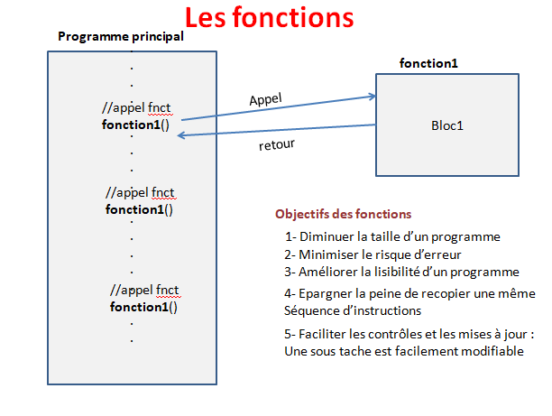

Leurs avantages:
- Raccourcir le code en évitant de répéter des lignes de code identiques
- Appeler une fonction suite à une action de l'user
- ...

Le langage JavaScript dispose de nombreuses fonctions que nous pouvons utiliser pour effectuer différentes tâches. Les fonctions définies dans le langage sont appelées fonctions prédéfinies ou fonctions prêtes à l’emploi car il nous suffit de les appeler pour
nous en servir.
**Pour être tout à fait précis, les fonctions prédéfinies en JavaScript sont des méthodes**.
Une méthode est tout simplement le nom donné à une fonction définie au sein d’un objet.
Pour le moment, nous allons considérer que ce sont simplement des fonctions.
L’intérêt principal des fonction prédéfinies est de nous permettre de réaliser des opérations complexes de manière très simple : **en les appelant**. En effet, vous devez bien comprendre que derrière ces noms de fonctions se cachent des codes parfois longs et complexes qui vont être exécutés lorsqu’on appelle la fonction et qui vont permettre de réaliser une opération précise (générer un nombre aléatoire, etc.).

**Pour exécuter le code caché derrière la fonction, il suffit de l’appeler ou de « l’invoquer ».Pour faire cela, on n’a qu’à écrire le nom de la fonction suivi d’un couple de parenthèses et éventuellement préciser des arguments entre les parenthèses**.

Exemple:

    function sayHello(nom,prenom){
        const hello = "bonjour ${prenom} ${nom};
        returnhello;
    }
    ->cette fonction retourne une chaîne de caractère
    **function**: création de fonction
    sayHello: nom de la fonction
    (nom,prenom): **arguments**,permettent de spécifier que pour utiliser notre fonction,il faudra lui apporter ces deux arguments, ces deux données
    **return**hello: la fonction va répondre quelque chose

### Les arguments

Les arguments d’une fonction sont des valeurs qu’on va passer à notre fonction afin qu’elle fonctionne normalement ou pour préciser le comportement qu’elle doit adopter. Certaines fonctions ne vont pas nécessiter d’arguments, d’autres vont avoir besoin d’un argument,
d’autres de deux, etc. De plus, certains arguments vont être obligatoires tandis que d’autres vont être facultatifs.

### Les fonctions personnalisées

En plus des nombreuses fonctions JavaScript prédéfinies et immédiatement utilisables, nous allons pouvoir créer nos propres fonctions en JavaScript lorsque nous voudrons effectuer une tâche très précise.
Lorsqu’on crée une fonction en JavaScript, celle-ci n’est utilisable que par les scripts qui ont accès à sa définition. Une fonction n’est pas « magiquement incluse » dans le langage. Créer nos propres fonctions va nous permettre de gagner du temps de développement et
de créer des scripts plus facilement maintenables et plus sécurisés.

Pour pouvoir utiliser une fonction personnalisée, en pratique, il faut déjà la définir. **Pour définir une fonction, on va utiliser le mot clef function suivi du nom que l’on souhaite donner à notre fonction puis d’un couple de parenthèses dans lesquelles on peut
éventuellement définir des paramètreset finalement d’un couple d’accolades dans lesquelles on va placer le code de notre fonction**.
Une fois notre fonction définie, on n’aura plus qu’à l’appeler pour l’utiliser.

Exemple:

    function aleatoire(){
        return Math.random() * 100;
    };
    function multiplication(nombre1, nombre2){
        return nombre1 + " * " + nombre2 + " * " + " = " + (nombre1 * nombre2);
    };

    document.getElementById("p1").innerHTML = aleatoire();
    document.getElementById("p2").innerHTML = multiplication(5, 10);
    ->on les appelle, exécute, ou invoque. On fournit ici deux arguments à multiplication. Ces arguements prennent la place des paramètres.
    ->Ici, nous créons deux fonctions qu’on appelle aleatoire() et multiplication(). Entre les  accolades, on définit le code qui devra être exécuté lorsqu’on appelle nos fonctions. Le but de notre fonction aleatoire() va être de renvoyer un nombre aléatoire entre 0 et 100. Pour cela, on commence par utiliser random() qui retourne un nombre aléatoire compris     entre 0 et 1 et on multiplie la valeur retournée par 100 pour avoir un nombre entre 0 et 100 tout simplement.
    ->Le but de notre deuxième fonction multiplication() est de renvoyer le résultat de la multiplication de deux nombres non connus lors de la définition de la fonction.Ici, il va donc falloir passer ces deux nombres à notre fonction lorsqu’on l’appelle afin qu’elle puisse les multiplier et renvoyer le résultat. Lors de l’appel, nous allons donc passer ces nombres en arguments de notre fonction, entre les parenthèses.
Cependant, on est ici face à un problème : comment expliciter le fait que notre fonction doit multiplier deux nombres entre eux lorsqu’on ne les connait pas à l’avance ?
Nous allons pour cela utiliser ce qu’on appelle des **paramètres**. **Les paramètres des fonctions sont des « prête-noms » qui seront remplacés par les valeurs effectives passées en argument lorsqu’on appelle notre fonction**. L’idée ici est qu’on va pouvoir donner n’importe quel nom à nos paramètres : je les appelle ici « nombre1 » et « nombre2 » mais je pourrais aussi bien les appeler « Pierre » et « Math» ou « x » et « y ». L’important va être de conserver les mêmes noms entre les parenthèses et dans le code de la fonction.
Une nouvelle fois, lorsqu’on appelle ensuite notre fonction, les arguments passés (c’està-dire les valeurs effectives) vont venir se substituer aux paramètres.

Notez qu’on utilise également ici pour nos deux fonctions une instruction **return**. Cette instruction va permettre à nos fonctions de retourner une valeur qu’on va ensuite pouvoir manipuler.

Les noms des fonctions suivent les mêmes règles que ceux des variables. Vous pouvez donc donner le nom que vous voulez à votre fonction du moment que celui-ci commence par une lettre, ne contient pas d’espace ni de caractères spéciaux et n’est pas déjà pris nativement par le JavaScript.

### Portée des variables et valeurs de retour des fonctions

#### La notion de portée des variables : définition

La **portée** d’une variable désigne l’espace du script dans laquelle elle va être accessible. En effet, toutes nos variables ne sont pas automatiquement disponibles à n’importe quel endroit dans un script et on ne va donc pas toujours pouvoir les utiliser.
En JavaScript, il n’existe que deux espaces de portée différents : **l’espace global et l’espace local**. Pour rester très simple, l’espace global désigne l’entièreté d’un script à l’exception de l’intérieur de nos fonctions. L’espace local désigne, à l’inverse, l’espace dans une fonction.
>une variable définie dans l’espace global d’un script va être accessible à travers tout le script, même depuis une fonction. En revanche, une variable définie dans une fonction n’est accessible que dans cette même fonction et ne peut pas être manipulée depuis l’espace global du script.

Exemples:

    let x = 5;
    var y = 10;
    function portee1(){
        document.getElementById("p1").innerHTML = 'Depuis portée1():  x = ' + x + "  y = " + y;
    };
    function portee2(){
        let a = 1;
        var b = 2;
        document.getElementById("p2").innerHTML = 'Depuis portée2():  a = ' + a + "  b = " + b;
    };
    ->exécution =>
    portee1();
    portee2();
    ->Notre fonction portee1() utilise par exemple nos variables let
    x et var y. Comme ces variables ont été déclarées dans l’espace global, elles sont doncaccessibles et utilisables dans la totalité du script et notamment dans des fonctions.
    Notre deuxième fonction portee2() déclare ses propres variables let a et var b. Ces variables sont donc des variables locales à cette fonction et ne vont pouvoir être utilisées que depuis cette fonction.

Dans le cas où une fonction utilise des variables locales, et globales, celle-ci va utiliser **les variables définies localement plutôt que globalement.
**Si une variable locale porte le même nom qu'une variable gloable, elles n'influent pas entre elles.Ce sont deux entités différentes!**

#### Les différences de portée entre les variables var et let en JavaScript

Dans l’exemple précédent, on n’a pu observer aucune différence de comportement entre une variable déclarée avec la syntaxe let et une variable déclarée avec var en JavaScript.
Il existe pourtant une différence de portée qu’on va pouvoir observer lors de la définition de variables locales. 
En effet, **lorsqu’on utilise la syntaxe let pour définir une variable à l’intérieur d’une fonction en JavaScript, la variable va avoir une portée dite « de bloc» : la variable sera accessible dans le bloc dans lequel elle a été définie et dans les blocs que le bloc contient.
En revanche, en définissant une variable avec le mot clef var dans une fonction, la variable aura une portée élargie puisque cette variable sera alors accessible dans tous les blocs de la fonction**. Prenons immédiatement un exemple pour bien comprendre cela:

Exemple: 

    function portee1(){
        let x = 1;
        var y = 2;
        if(true){
            let x = 5; => variable différente
            var y = 10; => même que précédente
            document.getElementById("p1").innerHTML = "x (dans if) = " + x;
            document.getElementById("p2").innerHTML = "y (dans if) = " + y;
        }
        document.getElementById("p3").innerHTML = "x (hors if) = " + x;
        document.getElementById("p4").innerHTML = "y (hors if) = " + y;
    };
    portee();
    =>x (dans if) = 5
    =>y (dans if) = 10
    =>x (hors if) = 1
    =>x (hors if) = 1

#### La valeur de retour des fonctions

Une valeur de retour est une valeur renvoyée par une fonction une fois que celle-ci a terminé son exécution. Une valeur de retour ne doit pas être confondu avec une instruction d’affichage durant l’exécution d’une fonction, comme dans le cas d’une fonction qui possède à un moment donné dans son code un alert() par exemple.
Une valeur de retour est une valeur unique qui va être renvoyée par la fonction après son exécution et qu’on va pouvoir récupérer pour la manipuler dans notre script.
Certaines fonctions prédéfinies vont renvoyer une valeur de retour tandis que d’autres ne vont pas en renvoyer.
Il est toujours très utile de savoir si une fonction prédéfinie en JavaScript va renvoyer une valeur ou pas et quel type de valeur la fonction va renvoyer puisque cela va nous permettre de savoir quoi faire après l’exécution de la fonction et d’éventuellement recueillir la valeur de retour pour effectuer différentes opérations.
Par exemple, certaines fonctions JavaScript renvoient le booléen true si elles ont réussi à effectuer leur tâche ou false en cas d’échec. Dans ce cas, on va pouvoir utiliser une condition autour de ces fonctions pour prendre en charge et donner des instructions en cas d’échec de notre fonction.
D’autres fonctions vont renvoyer directement le résultat de leur action, comme la fonction replace() par exemple qui va renvoyer une nouvelle chaine de caractères avec les remplacements effectués. Dans le cas de fonctions personnalisées, nous allons devoir décider si notre fonction va renvoyer une valeur ou pas.
Pour que nos fonctions renvoient une valeur, il va falloir utiliser une instruction **return**.
Cette instruction va nous permettre de retourner le résultat de la fonction ou une valeur de notre choix qu’on va ensuite pouvoir soit manipuler immédiatement soit stocker dans une variable pour effectuer différentes opérations avec cette valeur.
**Attention cependant : l’instruction return met fin à l’exécution d’une fonction, ce qui signifie que toutes les autres opérations qui suivent une instruction return dans une fonction seront ignorées**.
Pour cette raison, on fera toujours bien attention à placer l’instruction return en fin de fonction, après que toutes les opérations aient été réalisées.

### Fonctions anonymes, auto-invoquées et récursives

#### Qu’est-ce qu’une fonction anonyme et quels sont les cas d’usage ?

Les fonctions anonymes sont, comme leur nom l’indique, des fonctions qui ne vont pas posséder de nom. En effet, lorsqu’on crée une fonction, nous ne sommes pas obligés de lui donner un nom à proprement parler.
Généralement, on utilisera les fonctions anonymes lorsqu’on n’a pas besoin d’appeler notre fonction par son nom c’est-à-dire lorsque le code de notre fonction n’est appelé qu’à un endroit dans notre script et n’est pas réutilisé.
En d’autres termes, les fonctions anonymes vont très souvent simplement nous permettre de gagner un peu de temps dans l’écriture de notre code et (bien que cela porte à débat) à le rendre plus clair en ne le polluant pas avec des noms inutiles.

#### Création et exécution ou appel d’une fonction anonyme

On va pouvoir créer une fonction anonyme de la même façon qu’une fonction classique, en utilisant le mot clef function mais en omettant le nom de la fonction après.

Exemple:

    function(){
        alert("txt");
    }; => Nous avons ici déclaré une fonction anonyme donc le rôle est d’exécuter une fonction alert() qui va elle-même renvoyer un message dans une boîte d' alerte.

Ici, nous faisons pourtant face à un problème : comment appeler une fonction qui n’a pas de nom ?

On va avoir plusieurs façons de faire en JavaScript. Pour exécuter une fonction anonyme, on va notamment pouvoir :
• Enfermer le code de notre fonction dans une variable et utiliser la variable comme une fonction,
• Auto-invoquer notre fonction anonyme,
• Utiliser un évènement pour déclencher l’exécution de notre fonction.

##### Exécuter une fonction anonyme en utilisant une variable

Enfermer la fonction dans une variable et utiliser la variable comme une fonction.

    let alert = function(){
        alert("txt");
    };
    alert();
    ->Ici, on affecte notre fonction anonyme à une variable nommée let alerte.
Notre variable contient ici une valeur complexe qui est une fonction et on va désormais pouvoir l’utiliser comme si c’était une fonction elle-même.
Pour « appeler notre variable » et pour exécuter le code de la fonction anonyme qu’elle contient, il va falloir écrire le nom de la variable suivi d’un couple de parenthèses.**Ces parenthèses sont des parenthèses dites « appelantes » car elles servent à exécuter la fonction qui les précède**.

##### Auto-invoquer une fonction anonyme

La deuxième façon d’exécuter une fonction anonyme va être de créer une fonction anonyme qui va s’auto-invoquer c’est-à-dire qui va s’invoquer (ou s’appeler ou encore s’exécuter) elle-même dès sa création.
**Pour créer une fonction auto-invoquée à partir d’une fonction, il va tout simplement falloir rajouter un couple de parenthèses autour de la fonction et un second après le code de la fonction**.

Nous avons vu précédemment que le couple de parenthèses suivant le nom de notre
variable stockant notre fonction anonyme servait à lancer l’exécution de la fonction, de la même manière, le couple de parenthèses après la fonction va faire en sorte que la fonction s’appelle elle-même.

Exemples:

    (function(){alert("txt");})();
    ->fonction anonyme auto-invoquée
    (functionbonjour(){alert("txt");})();
    ->fonction nommée auto-invoquée
Vous pouvez noter deux choses à propos des fonction auto-invoquées. Tout d’abord, vous devez savoir que la notion d’auto-invocation n’est pas réservée qu’aux fonctions anonymes : on va tout à fait pouvoir auto-invoquer une fonction qui possède un nom. Cependant, en pratique, cela n’aura souvent pas beaucoup d’intérêt (puisque si une fonction possède un nom, on peut tout simplement l’appeler en utilisant ce nom).

##### Exécuter une fonction anonyme lors du déclenchement d’un évènement

On va enfin également pouvoir rattacher nos fonctions anonymes à ce qu’on appelle des « gestionnaires d’évènements » en JavaScript.
Pour indiquer comment on veut répondre à tel évènement, on utilise des gestionnaires d’évènements qui sont des fonctions qui vont exécuter tel code lorsque tel évènement survient.

On va pouvoir passer une fonction anonyme à un gestionnaire d‘évènement qui va l’exécuter dès le déclenchement de l’évènement que le gestionnaire prend en charge.

Exemple:

    let para1 = getElementById("p1");
    let para2 = getElementById("p2");
    para1.addEventListener("click", function(){alert("clic sur p id=p1");});
    para1.addEventListener("click", function(){alert("clic sur p id=p2");});
    ->on utilise la fonction addEventListener() qui sert de gestionnaire d' événement. Ici on demande à exécuter la fonction anonyme passée en deuxième argument lors du clic sur élément p.

#### Les fonctions récursives

Une fonction récursive est une fonction qui va s’appeler elle-même au sein de son code.
Tout comme pour les boucles, les fonctions récursives vont nous permettre d’exécuter une action en boucle et jusqu’à ce qu’une certaine condition de sortie soit vérifiée.

Exemple:

    function decompte(t) {
        if (t > 0) {
            document.getElementById("p1").innerHTML += t + " ";
            return decompte(t - 1);
        }
        else {
            return t;
        }
    };
    decompte(7);

### Réutiliser la fonction

Exemple:

      function sayHello(nom,prenom){
        const hello = "bonjour ${prenom} ${nom};
        returnhello;
    }
    console.log(sayHello("vilport","cecile"));

### Valeurs par défaut

Il est possible de spécifier des valeurs par défaut pour nos arguments, ainsi si un user oublie  ou ne connaît pas un des arguments demandés,une valeur par défaut lui sera attribuée.
De ce fait, ceci permet également, de rendre cet argument optionnel:

    function sayHello(nom,prenom = "M/Me"){
        const hello = "bonjour ${prenom} ${nom};
        returnhello;
    }
    console.log sayHello("vilport");
    -> M/Me vilport

## Introduction à la programmation orientée objet en JavaScript

### Les paradigmes de programmation

Un « paradigme » de programmation est une façon d’approcher la programmation
informatique, c’est-à-dire une façon de voir (ou de construire) son code et ses différents éléments. 

Il existe trois paradigmes de programmation particulièrement populaires, c’est-à-dire trois grandes façons de penser son code :

• **La programmation procédurale**,
• **La programmation fonctionnelle**,
• **La programmation orientée objet**.

->La programmation procédurale est le type de programmation le plus commun et le plus populaire. C’est une façon d’envisager son code sous la forme d’un enchainement de procédures ou d’étapes qui vont résoudre les problèmes un par un. Cela correspond à une approche verticale du code où celui-ci va s’exécuter de haut en bas, ligne par ligne.
Jusqu’à présent, nous avons utilisé cette approche dans nos codes JavaScript.

->La programmation fonctionnelle est une façon de programmer qui considère le calcul en tant qu’évaluation de fonctions mathématiques et interdit le changement d’état et la mutation des données. La programmation fonctionnelle est une façon de concevoir un code en utilisant un enchainement de fonctions « pures », c’est-à-dire des fonctions qui vont toujours retourner le même résultat si on leur passe les mêmes arguments et qui ne vont retourner qu’une valeur sans modification au-delà de leur contexte.

->La programmation orientée objet est une façon de concevoir un code autour du concept d’objets. Un objet est une entité qui peut être vue comme indépendante et qui va contenir un ensemble de variables (qu’on va appeler propriétés) et de fonctions (qu’on appellera méthodes). Ces objets vont pouvoir interagir entre eux.

Les choses importantes à retenir pour le moment sont les suivantes :
1. Il existe différentes façons de penser / voir / concevoir son code qu’on appelle «paradigmes » ;
2. La plupart des langages supportent aujourd’hui plusieurs paradigmes et le
JavaScript, en particulier, supporte chacun des trois paradigmes principaux cités ci-dessus ce qui signifie qu’on va pouvoir coder en procédural, en fonctionnel et en orienté objet en JavaScript ;
3. Un paradigme n’est qu’une façon de coder il est important de comprendre qu’un paradigme n’exclut pas les autres. Au contraire, on va souvent utiliser plusieurs paradigmes dans un même script en fonction de ce qu’on souhaite réaliser.

### Première définition de l’orienté objet et des objets en JavaScript

Le JavaScript est un langage qui possède un fort potentiel pour la programmation orientée objet (abrégée en POO).
En effet, le JavaScript est un langage qui intègre l’orienté objet dans sa définition même ce qui fait que tous les éléments du JavaScript vont soit être des objets, soit pouvoir être convertis et traités comme des objets.

**Un objet, en informatique, est un ensemble cohérent de données et de fonctionnalités qui vont fonctionner ensemble. Pour le dire très simplement, un objet en JavaScript est un conteneur qui va pouvoir stocker plusieurs variables qu’on va appeler ici des propriétés.Lorsqu’une propriété contient une fonction en valeur, on appelle alors la propriété une méthode. Un objet est donc un conteneur qui va posséder un ensemble de propriétés et de méthodes qu’il est cohérent de regrouper**.

> Un objet est un ensemble de propriétés et une propriété est une association entre un nom (aussi appelé **clé**) et une **valeur**. La valeur d'une propriété peut être une fonction, auquel cas la propriété peut être appelée « méthode ». En plus des objets natifs fournis par l'environnement, il est possible de construire ses propres objets.

Exemples:

    let myBook = {
        title: 'The Story of Tau',
        author: 'Will Alexander',
        numberOfPages: 250,
        isAvailable: true
    };

    let user = {
        nom : ["pierre", "rigot"],
        age : 29,
        mail : "rigotpierre@gmail.com",
        bonjour : function(){
            alert("Bonjour, je suis " + this.nom[0] + " ,j'ai " + this.age + " ans");
        }
    };
    alert(typeof user);
    ->la variable user est une variable objet ou un objet.
    nom, age, mail sont des propriétés de l' objet user. La valeur de la propriété nom est un tableau.
    bonjour est une méthode de l' objet user.
    On a créé notre premier objet.
    ->Un objet est défini entre accolades, on va y placer des attributs.
->Pour créer un objet, on commence par définir et initialiser une variable.
Dans le cas présent, notre variable let user stocke notre objet. Par simplification, on dira que cette variable « est » un objet mais pour être tout à fait exact il faudrait plutôt dire qu’elle stocke une valeur de type objet.
Comme vous pouvez le voir, on utilise ici une syntaxe différente de celle dont on a l’habitude pour déclarer notre objet. Tout d’abord, vous pouvez remarquer qu’on utilise **dans le cas de la création d’un objet littéral une paire d’accolades qui indiquent au JavaScript qu’on souhaite créer un objet**.
Ce qui nous intéresse particulièrement ici sont les **membres de notre objet**. Un « membre » est un couple « nom : valeur », et peut être une propriété ou une méthode. Comme vous pouvez le voir, notre objet est ici composé de différents membres : 3 propriétés et 1 méthode:

- La première propriété nom de notre objet est particulière puisque sa valeur associée est un tableau. 
- Le membre nommé bonjour de notre objet est une méthode puisqu’une fonction anonyme lui est associée en valeur. Vous pouvez également remarquer l’usage du mot clef this et de l’opérateur "." dans notre méthode.

**Chaque membre d’un objet est toujours composé d’un nom et d’une valeur qui sont séparés par :. Les différents membres d’un objet sont quant-à-eux séparés les uns des autres par des virgules (et non pas des points-virgules, attention !)**.

>Les objets JavaScript sont écrits en JSON (JavaScript Object Notation). Ce sont des séries de paires clés-valeurs séparées par des virgules, entre des accolades. Les objets peuvent être enregistrés dans une variable.Chaque clé est une chaîne (title, author, numberOfPages...), et les valeurs associées peuvent avoir tout type de données (nombre, chaîne, etc.).

>Quels avantages et intérêts de coder en orienté objet en JavaScript ?
Le développement orienté objet correspond à une autre façon d’envisager et d’organiser son code en groupant des éléments cohérents au sein d’objets.
Les intérêts supposés principaux de développer en orienté objet plutôt qu’en procédural par exemple sont de permettre une plus grande modularité ou flexibilité du code ainsi qu’une meilleure lisibilité et une meilleure maintenabilité de celui-ci.

>Construire des objets présente un avantage essentiel : cela permet de regrouper les attributs d'une chose unique à un même emplacement, que ce soit un livre, un profil d'utilisateur ou la configuration d'une application, par exemple.

## Création d’un objet littéral

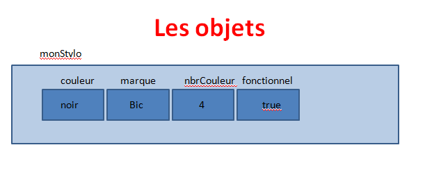

Un objet est un ensemble cohérent de propriétés et de méthodes. Le JavaScript dispose **d’objets natifs** (objets prédéfinis) qui possèdent des propriétés et des méthodes qu’on va pouvoir directement utiliser et nous permet également de définir nos propres objets.

Nous pouvons créer des objets de 4 manières différentes en JavaScript. On va pouvoir :

• Créer un objet littéral,
• Utiliser le constructeur Object(),
• Utiliser une fonction constructeur personnalisée,
• Utiliser la méthode create().

Ces différents moyens de procéder vont être utilisés dans des contextes différents, selon
ce que l’on souhaite réaliser.

### Création d’un objet littéral

Précedemment, nous avons créé un premier objet nommé utilisateur. Pour être tout à fait précis, nous avons créé un **objet littéral** (on parle ici d’objet « littéral » car nous avons défini chacune de ses propriétés et de ses méthodes lors de la création, c’est-à-dire littéralement).

Pour créer un objet littéral, **on utilise une syntaxe utilisant une paire d’accolades { … } qui indique au JavaScript que nous créons un objet**.

Nos objets vont généralement être stockés dans des variables. Par abus de langage, on confondra alors souvent la variable et l’objet et on parlera donc « d’objet » pour faire référence à notre variable stockant une valeur de type objet. Dans l’exemple ci-dessus, on dira donc qu’on a créé un objet nommé « utilisateur ».

Un objet est composé de différents couples de **« nom : valeur »** qu’on appelle **membres**:
**chaque nom d’un membre doit être séparé de sa valeur par un caractère deux-points : et les différents membres d’un objet doivent être séparés les uns des autres par une virgule**.
La partie « nom » de chaque membre suit les mêmes règles que le nommage d’une
variable. La partie valeur d’un membre peut être n’importe quel type de valeur : une chaine de caractère, un nombre, une fonction, un tableau ou même un autre objet littéral.

**Les membres d’un objet qui ne servent qu’à stocker des données sont appelés des propriétés tandis que ceux qui manipulent des données (c’est-à-dire ceux qui contiennent des fonctions en valeur) sont appelés des méthodes**.

### Utiliser le point pour accéder aux membres d’un objet, les modifier ou en définir de nouveaux = dot notation 

**Pour accéder aux propriétés et aux méthodes d’un objet, on utilise le caractère point . qu’on appelle également un accesseur. On va ici commencer par préciser le nom de l’objet puis l’accesseur puis enfin le membre auquel on souhaite accéder**.

Exemples:

    document.getElementById.innerHTML = "nom: " + user.nom;
    ->accès à la propriété nom de user

    user.age = 30;
    ->modification valeur de l' âge de user

    user.bonjour();
    ->accès à la méthode de l' objet user, exécutée comme une fonction anonyme

    let myBook = {
        title: "L'Histoire de Tao",
        author: "Will Alexander",
        numberOfPages: 250,
        isAvailable: true
    };
    let bookTitle = myBook.title;  // "L'Histoire de Tao"
    let bookPages = myBook.numberOfPages  // 250
    =>nomvarquicontientobjet.clé pour récupèrer sa valeur

Cela nous permet de récupérer les valeurs des propriétés.
En dessous, on utilise notre accesseur avec l’opérateur d’affectation = pour cette fois-ci modifier la valeur de la propriété age de notre objet user.
Finalement, on utilise notre accesseur pour exécuter la méthode bonjour() de
l’objet user. Pour faire cela, on procède de la même façon que pour exécuter une fonction anonyme placée dans une variable.
Enfin, on va encore pouvoir utiliser notre accesseur pour créer de nouveaux membres pour notre objet. Pour cela, il suffit de définir un nouveau nom de membre et de lui passer une valeur comme cela:

Exemples:

    user.taille = 170;

    user.prez = function(){
        alert("txt");
    }
    ->ici, on ajoute une propriété taille et une méthode prez() à notre objet user. 

Il existe également la **notation bracket (bracket notation)**
Pour accéder à un sous élément vous pouvez utiliser les brackets avec la valeur du sous élément.

Exemple :

    let myBook = {
       title: "L'Histoire de Tao",
       author: "Will Alexander",
       numberOfPages: 250,
       isAvailable: true
    };
    let bookTitle = myBook["title"];  // "L'Histoire de Tao"
    let bookPages = myBook["numberOfPages"];  // 250
    ->L'intérêt ici c’est qu’on va pouvoir mettre entre bracket une variable qui contient en string le nom de la propriété que l’on souhaite atteindre.

    let myBook = {
        title: "L'Histoire de Tao",
        author: "Will Alexander",
        numberOfPages: 250,
        isAvailable: true
    };
    let propertyToAccess = "title";
    let bookTitle = myBook[propertyToAccess];  // "L'Histoire de Tao"

### Utiliser les crochets pour accéder aux propriétés d’un objet, les modifier ou en définir de nouvelles

On va également pouvoir utiliser des crochets plutôt que le point pour accéder aux propriétés de nos objets, mettre à jour leur valeur ou en définir de nouvelles. Cela ne va en revanche pas fonctionner pour les méthodes.
Les crochets vont être particulièrement utiles avec les valeurs de type tableau (qui sont des objets particuliers qu’on étudiera plus tard dans ce cours) puisqu’ils vont nous permettre d’accéder à une valeur en particulier dans notre tableau.
Dans le code précédent, la valeur de la propriété nom par exemple est un tableau. Notez qu’on utilise également ces mêmes crochets pour définir un tableau.

**En programmation, un tableau correspond à un ensemble de valeurs auxquelles vont être associées des index ou des clefs. On appelle l’ensemble clef + valeur un élément du tableau**.
La plupart des langages de programmation gèrent deux types de tableaux : **les tableaux numérotés et les tableaux associatifs**. Le principe des tableaux numérotés est que les clefs associées aux valeurs vont être des chiffres. Par défaut, la première valeur va recevoir la clef 0, la deuxième valeur sera associée à la clef 1 et etc. Les tableaux associatifs vont eux avoir des clefs textuelles qui vont être définies manuellement.

->Pour accéder à une valeur en particulier dans un tableau, on utilise la syntaxe **« nom_du_tableau[clef] »**.
Le JavaScript est un langage qui ne supporte que l’utilisation de tableaux numérotés. Dans le cas présent, notre propriété nom contient un tableau qui possède deux éléments : la valeur du premier élément est « Pierre » et la clef associée par défaut est 0. La valeur du deuxième élément est « girot » est la clef associée par défaut est 1.
Pour accèder à la valeur pierre de la propriété nom de l' objet user : user.nom[0].

On va pouvoir en JavaScript utiliser cette même syntaxe pour accéder à n’importe quelle propriété d’un objet, pour modifier la valeur d’une propriété ou encore pour définir de nouvelles propriétés:
pour faire cela, on va faire « comme si » notre objet était un tableau associatif composés d’éléments dont les clefs sont les noms des propriétés et les valeurs sont les valeurs associées.
->pour accéder à la valeur complète de la propriété nom de l’objet user, on pourra ainsi écrire **user['nom']**. Pour accéder à la valeur de mail, on écrira **user['mail']**. Si on souhaite accéder à la valeur du premier élément de notre tableau nom, on pourra encore écrire **user['nom'][0]**.

### L’utilisation du mot clef this

Il nous reste une dernière partie de notre objet à définir : le mot clef **this** qu’on utilise au sein de notre méthode bonjour().

Le mot clef this est un mot clef qui apparait fréquemment dans les langages orientés objets. Dans le cas présent, il sert à faire référence à l’objet qui est couramment manipulé.

>Pour le dire très simplement, c’est un prête nom qui va être remplacé par le nom de l’objet actuellement utilisé lorsqu’on souhaite accéder à des membres de cet objet.

## Définition et création d’un constructeur

Dans cette leçon, nous allons voir d’autres méthodes de création d’objets et allons notamment apprendre à créer des objets à la chaine et de manière dynamique en utilisant une fonction constructeur personnalisée.

### Les usages de l’orienté objet et l’utilité d’un constructeur d’objets

On va généralement utiliser la programmation orientée objet dans le cadre de gros projets où on doit répéter de nombreuses fois des opérations similaires. Dans la majorité des cas, lorsqu’on utilise l’orienté objet, on voudra pouvoir créer de multiples objets semblables, à la chaine et de manière dynamique.

Imaginons par exemple que l’on souhaite créer un objet à chaque fois qu’un utilisateur enregistré se connecte sur notre site. Chaque objet « utilisateur » va posséder des propriétés (un pseudonyme, une date d’inscription, etc.) et des méthodes similaires (possibilité de mettre à jour ses informations, etc.).
Dans ces cas-là, plutôt que de créer les objets un à un de manière littérale, il serait pratique de créer une sorte de plan ou de schéma à partir duquel on pourrait créer des objets similaires à la chaine.
->Nous allons pouvoir faire cela en JavaScript en utilisant ce qu’on appelle un constructeur d’objets qui n’est autre qu’une **fonction constructeur**.

### La fonction construction d’objets : définition et création d’un constructeur

**Une fonction constructeur d’objets est une fonction qui va nous permettre de créer des objets semblables**. En JavaScript, n’importe quelle fonction va pouvoir faire office de constructeur d’objets.

Pour construire des objets à partir d’une fonction constructeur, nous allons devoir suivre deux étapes: 
- il va déjà falloir définir notre fonction constructeur,
- ensuite nous allons appeler ce constructeur avec une syntaxe un peu spéciale utilisant le mot clef **new**.

Dans une fonction constructeur, on va pouvoir définir un ensemble de propriétés et de méthodes. Les objets créés à partir de ce constructeur vont automatiquement posséder les (hériter des) propriétés et des méthodes définies dans le constructeur.

Comment une fonction peut-elle contenir des propriétés et des méthodes ?
C’est très simple : **les fonctions sont en fait un type particulier d’objets en JavaScript ! Comme tout autre objet, une fonction peut donc contenir des propriétés et des méthodes**.

Exemple:
Pour rendre les choses immédiatement concrètes, essayons de créer un constructeur ensemble dont on expliquera ensuite le fonctionnement.
Pour cela, on va se baser sur l’objet littéral créé dans la leçon précédente. L’objectif ici va être de créer une fonction qui va nous permettre de créer des objets possédant les mêmes propriétés nom, age, mail et méthode bonjour() que notre objet littéral.

    function Utilisateur(n, a, m){
        this.nom = n;
        this.age = a;
        this.mail = m;
        this.bonjour = function(){
            alert("txt");
        }
    };
    ->On définit ici une fonction Utilisateur() qu’on va utiliser comme constructeur d’objets.Comme vous pouvez le voir, le code de notre fonction est relativement différent des autres fonctions qu’on a pu créer jusqu’ici, avec notamment l’utilisation du mot clef this qui va
    permettre de définir et d’initialiser les propriétés ainsi que les méthodes de chaque objet créé.
    Notre constructeur possède trois paramètres qu’on a ici nommé n, a et m qui vont nous permettre de transmettre les valeurs liées aux différentes propriétés pour chaque objet.A chaque création d’objet, c’est-à-dire à chaque appel de notre constructeur en utilisant le
    mot clef this, on va passer en argument les valeurs de l’objet relatives à ses propriétés nom, age et mail.
    Dans notre fonction, la ligne this.nom suffit à créer une propriété nom pour chaque objet créé via le constructeur. Écrire this.nom = n permet également d’initialiser cette propriété.

**Notez que lorsqu’on définit un constructeur, on utilise par convention une majuscule au début du nom de la fonction afin de bien discerner nos constructeurs des fonctions classiques dans un script.
L’idée d’un constructeur en JavaScript est de définir un plan de création d’objets. Comme ce plan va potentiellement nous servir à créer de nombreux objets par la suite, on ne peut pas initialiser les différentes propriétés en leur donnant des valeurs effectives, puisque les valeurs de ces propriétés vont dépendre des différents objets créés**.

#### Créer des objets à partir d’une fonction constructeur

Pour créer ensuite de manière effective des objets à partir de notre constructeur, nous allons simplement appeler le constructeur en utilisant le mot clef **new**. On dit également qu’on crée une nouvelle instance.

Exemple:

    function Utilisateur(n, a, m){
        this.nom = n;
        this.age = a;
        this.mail = m;
        this.bonjour = function(){
            alert("txt");
        }
    };
    ->fonction constructeur

    let user = new Utilisateur(["pierre", "giro"], 29, "adressemail.com");
    ->création objet user en utilisant le constructeur

    user.bonjour("txt");
    ->on peut ensuite utiliser les membres de l'objet créé et par exemple appeler la méthode bonjour()
    =>Lorsqu’on écrit let user = new Utilisateur(['txt', 'txt'], 29, 'txt'), on crée un nouvel objet pierre en appelant la fonction constructeur Utilisateur().Ici, on passe le tableau ['txt', 'txt'] en premier argument, le nombre 29 en deuxième  et mail en troisième argument.
    Lors de l’exécution du constructeur, la ligne this.nom = n va donc être remplacée par user.nom = ['Pierre', 'giro'] ce qui crée une propriété nom pour notre objet user avec la valeur ['Pierre', 'giro'] et etc.

Comme notre constructeur est une fonction, on va pouvoir l’appeler autant de fois qu’on le veut et donc créer autant d’objets que souhaité à partir de celui-ci et c’est d’ailleurs tout l’intérêt d’utiliser un constructeur. Chaque objet créé à partir de ce constructeur partagera
les propriétés et méthodes de celui-ci.

Exemples:

    let mathilde = new Utilisateur(["math", "soja"], 33, "mail.com");
    document.getElementById.innerHTML = 'Prénom de user : " + user["nom"][0];
    document.getElementById.innerHTML = 'age de mathilde : " + mathilde["age"];

#### Constructeur et différenciation des objets

On pourrait à première vue penser qu’il est contraignant d’utiliser un constructeur puisque cela nous « force » à créer des objets avec une structure identique et donc n’offre pas une grande flexibilité.
En réalité, ce n’est pas du tout le cas en JavaScript puisqu’on va pouvoir, une fois un objet créé et à n’importe quel moment de sa vie, modifier les valeurs de ses propriétés et ses méthodes ou lui en attribuer de nouvelles.

La fonction constructeur doit vraiment être vue en JavaScript comme un plan de base pour la création d’objets similaires et comme un moyen de gagner du temps et de la clarté dans son code. On ne va définir dans cette fonction que les caractéristiques communes de nos objets et on pourra ensuite rajouter à la main les propriétés particulières à un objet.

Exemple:
On va rajouter une propriété taille à objet user après sa création.

    user.taille = 170;
    =>Notre objet pierre dispose désormais d’une propriété taille qui lui est exclusive (les autres objets créés ne possèdent pas cette propriété).

### Constructeur Object, prototype et héritage

Nous allons définir ce qu’est un prototype et comprendre comment le JavaScript utilise les prototypes pour permettre à certains d’objets d’avoir accès aux méthodes et propriétés définies dans d’autres objets.

#### L’utilisation d’un constructeur et la performance

Précedemment, nous avons pu créer plusieurs objets semblables en appelant plusieurs fois une fonction constructeur personnalisée Utilisateur() et en utilisant le mot clef new.

Exemple:

    function Utilisateur(n, m, a){
        this.nom = n;
        this.age = a;
        this.mail = m;

        this.bonjour = function(){
            alert(`Bonjour, je suis ${this.nom[0]} , j' ai ${this.age} ans`);
        }
    };
    let pierre = new Utilisateur([nom1, prenom1], 29, mail1);
    let mathilde = new Utilisateur([nom2, prenom2], 30, mail2);
    ->création de deux objets pierre et mathilde grâce au constructeur.

On définit une fonction constructeur, puis on crée deux variables qui vont stocker deux objets créés à partir du constructeur. Chaque objet va disposer de sa propre copie des propriétés et méthode du constructeur, chaque objet va posséder 3 propriétés: nom, age, mail et une méthode bonjour() qui vont lui appartenir.

En littéral: 

    let pierre = {
        nom : [nom1, prenom1],
        age : 29;
        mail : mail1;
        bonjour : function{
            alert...
        }
    }

Dans ce cas, le code n'est pas optimal car en utilisant le constructeur plusieurs fois, on copie la méthode bonjour() identique à chaque fois.
Ici, l'idéal erait de définir notre ùéthode une seule fois, et que chauqe objet puisse l'utiliser lorsqu'il le souhaite.
Pour cela, on va utiliser des **prototypes**.

#### Le prototype en JavaScript orienté objet

Le JS est un langage orienté objet basé sur la notion de prototypes.
Il existe deux grands types de langages objet:
- ceux basés sur les classes,
- ceux basés sur les prototypes.
  
Une classe est un plan général qui va servir à créer des objets similaires.
Une classe va généralement contenir des propriétés, des méthodes et une méthode
constructeur. Cette méthode constructeur va être appelée automatiquement dès qu’on va créer un objet à partir de notre classe et va nous permettre dans les langages basés sur les classes à initialiser les propriétés spécifiques des objets qu’on crée.
Dans les langages orientés objet basés sur les classes, tous les objets sont créés à partir
de classes et vont hériter des propriétés et des méthodes définies dans la classe.

**Dans les langages orientés objet utilisant des prototypes comme le JavaScript, tout est objet et il n’existe pas de classes et l’héritage va se faire au moyen de prototypes**.

Rappelons nous que **les fonctions en JS sont avant tout des objets**.
Lorsque l'on crée une fonction, le JS va automatiquement lui ajouter une **propriété prototype** qui ne sera utile que lorsque la fonction est utilisée comme constructeur, c'est à dire quand on l' utilise avec la syntaxe new.
**Cette propriété prototype possède une valeur qui est elle même un objet**.On parlera donc de "prototype objet" ou "d' ojet prototype" pour parler de la propriété prototype.
Par défaut, elle ne contient que deux propriétés:
- une **propriété constructor** qui renvoie vers les constructeur contenant le prototype,
- et une **propriété _proto_** qui contient elle-même de nombreuses propriétés et méthodes.
Lorsque l'on crée un objet à partir d'un constructeur, le JS va également ajouter une propriété _proto_ à l'objet créé, égale à celle du constrcuteur.

A quoi servent la propriété prototype d’un constructeur et la propriété __proto__ dont
disposent à la fois le constructeur mais également tous les objets créés à partir de celui-ci ?
En fait, le contenu de la propriété prototype d’un constructeur va être partagé par tous les objets créés à partir de ce constructeur. Comme cette propriété est un objet, on va pouvoir lui ajouter des propriétés et des méthodes que tous les objets créés à partir du
constructeur vont partager ->
**cela permet l’héritage en orienté objet JavaScript. On dit qu’un objet « hérite » des membres d’un autre objet lorsqu’il peut accéder à ces membres définis dans l’autre objet**.
En l’occurrence, ici, les objets crées à partir du constructeur ne possèdent pas vraiment
les propriétés et les méthodes définies dans la propriété prototype du constructeur mais
vont pouvoir y accéder et se « partager » ces membres définis dans l’objet prototype du
constructeur.
Pour faire fonctionner cela, il faut se rappeler que **la propriété prototype est un objet** et qu'on va donc pouvoir lui ajouter des propriétés et des méthodes comme pour tout autre objet.

Exemple:

    function Utilisateur(n, a, m){
        this.nom = n;
        this.age = a;
        lthis.mail = m;
    }
    ->Utilisateur() est une fonction constructeur.

    Utilisateur.prototype.taille = 170;
    Utilisateur.prototype.bonjour = function (){
        alert(`Bonjour, je suis ${this.nom[0]} , j'ai ${this.age} ans`);
    };
    ->On ajoute des propriétés et méthodes au prototype de Ustilisateur comme n' importe quel objet.

    =>On ajoute une propriété taille et une méthode bonjour() à la propriété du prototype constructeur. Chaque objet créé à partir de ce constructeur va av oir accès à cette propriété et cette méthode.

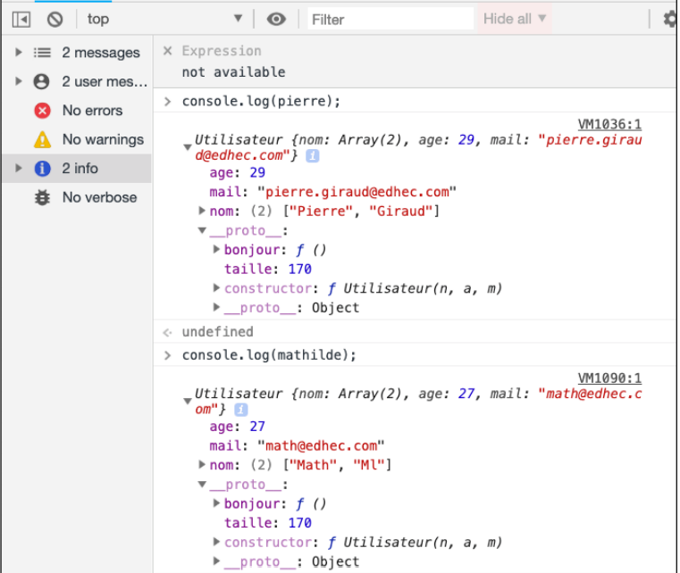

Définir des propriétés et des méthodes dans le prototype d'un constructeur nous permet ainsi de les rendre accessible à tous les objets créés à partir de ce constructeur sans que ces objets aient à les redéfinir.
**Pour avoir du code plus clair et plus performant, on définira généralement les propriétés des objets (dont les valeurs doivent être spécifique à l'objet) au sein du constructeur et les méthodes (que tous les objets vont pouvoir appeler de la même façon) dans le prototype du constructeur.**

Les différents objets se "partagent" ici la même propriété taille et la même méthode bonjour()définies dans le constructeur.

#### La chaine des prototypes ou chaine de prototypage et l’objet Object

Comment un objet peut-il accéder à une propriété ou à une méthode définie dans un autre objet ?

Pour répondre à cette question, il faut savoir que lorsqu’on essaie d’accéder à un membre
d’un objet, le navigateur (qui exécute le JavaScript) va d’abord chercher ce membre au sein de l’objet.
S’il n’est pas trouvé, alors le membre va être cherché au sein de la propriété proto de l’objet dont le contenu est, rappelons-le, égal à celui de la propriété prototype du constructeur qui a servi à créer l’objet.

## L ' asynchrone en JS

Par défaut, **le JavaScript est un langage synchrone, bloquant et qui ne s’exécute que sur un seul thread**. 
Cela signifie que:
Les différentes opérations vont s’exécuter les unes à la suite des autres (elles sont synchrones) ;
Chaque nouvelle opération doit attendre que la précédente ait terminé pour démarrer (l’opération précédente est « bloquante ») ;
Le JavaScript ne peut exécuter qu’une instruction à la fois (il s’exécute sur un thread, c’est-à-dire un « fil » ou une « tâche » ou un « processus » unique).

Cela est problématique, par exemple: temps exécution des boucles, …

Le JavaScript nous fournit des outils pour créer du code asynchrone.

### Les fonctions de rappel: à la base de l’ asynchrone en JS.

En JavaScript, les opérations asynchrones sont placées dans des files d'attente qui vont s’exécuter après que le fil d’exécution principal ou la tâche principale (le « main thread » en anglais) ait terminé ses opérations. Elles ne bloquent donc pas l’exécution du reste du code JavaScript.
L’idée principale de l’asynchrone est que le reste du script puisse continuer à s’exécuter pendant qu’une certaine opération plus longue ou demandant une réponse / valeur est en cours. Cela permet un affichage plus rapide des pages et en une meilleure expérience utilisateur.
Le premier outil utilisé en JavaScript pour générer du code asynchrone a été les fonctions de rappel. En effet, une fonction de rappel ou « callback » en anglais est une fonction qui va pouvoir être rappelée (« called back ») à un certain moment et / ou si certaines conditions sont réunies.
L’idée ici est de passer une fonction de rappel en argument d’une autre fonction. Cette fonction de rappel va être rappelée à un certain moment par la fonction principale et pouvoir s’exécuter, sans forcément bloquer le reste du script tant que ce n’est pas le cas.

Exemple:

Utilisation de la méthode setTimeout() qui permet d’exécuter une fonction de rappel après un certain délai ou encore avec la création de gestionnaires d'événements qui vont exécuter une fonction seulement lorsqu’un événement particulier se déclenche.

    /*setTimeout() est asynchrone : le reste du script va pouvoir s'exécuter sans avoir à attendre la fin de l'exécution de setTimeout()*/
    setTimeout(alert, 5000, 'Message affiché après 5 secondes');
    /*Cette alerte sera affichée avant celle définie dans setTimeout()
    alert('Suite du script');*/

Mais ces fonctions ont des limites: **le callback hell**.
Utiliser des fonctions de rappel pour générer du code asynchrone fonctionne mais possède certains défauts. Le principal défaut est qu’on ne peut pas prédire quand notre fonction de rappel asynchrone aura terminé son exécution, ce qui fait qu’on ne peut pas prévoir dans quel ordre les différentes fonctions vont s’exécuter.
Dans le cas où nous n’avons qu’une opération asynchrone définie dans notre script ou si nous avons plusieurs opérations asynchrones totalement indépendantes, cela ne pose pas de problème.
En revanche, cela va être un vrai souci si la réalisation d’une opération asynchrone dépend de la réalisation d’une autre opération asynchrone. Imaginons par exemple un code JavaScript qui se charge de télécharger une autre ressource relativement lourde. On va vouloir charger cette ressource de manière asynchrone pour ne pas bloquer le reste du script et pour ne pas que le navigateur « freeze ».
Lorsque cette première ressource est chargée, on va vouloir l’utiliser et charger une deuxième ressource, puis une troisième, puis une quatrième et etc.
Le seul moyen de réaliser cela en s’assurant que la ressource précédente soit bien disponible avant le chargement de la suivante va être d’imbriquer le deuxième code de chargement dans la fonction de rappel du premier code de chargement, puis le troisième code de chargement dans la fonction de rappel du deuxième code de chargement et etc.

    /*La fonction loadScript() crée un nouvel élément script et ajoute la valeur passée en argument à l'attribut src puis insère l'élément script dans l'élément head de notre fichier HTML*/
    function loadScript(src, callback) {
        let script = document.createElement('script');
        script.src = src;
        script.onload = () => callback(script);
        document.head.append(script);
    }
    loadScript('boucle.js', function(script){
        alert('Le fichier ' + script.src + ' a bien été chargé. x vaut : ' + x);
        loadScript('script2.js', function(script){
            /*Utilise les éléments du script boucle.js pour effectuer des opérations...*/
            alert('Le fichier ' + script.src + ' a bien été chargé');
            loadScript('script3.js', function(script){
                /*Utilise les éléments des scripts boucle.js et script2.js
                pour effectuer des opérations...*/
                alert('Le fichier ' + script.src + ' a bien été chargé');
            });
        });
    });alert('Message d\'alerte du script principal');

Ici, notre code n’est pas complet car on ne traite pas les cas où une ressource n’a pas pu être chargée, c’est-à-dire les cas d’erreurs qui vont impacter le chargement des ressources suivantes. Dans le cas présent, on peut imaginer que seul le script boucle.js est accessible et qu’il ressemble à cela.
Pour gérer les cas d’erreur, nous allons passer un deuxième argument à nos fonctions de rappel.

        function loadScript(src, callback) {
        let script = document.createElement('script');
        script.src = src;
        script.onload = () => callback(null, script);
        script.onerror = () => callback(new Error('Erreur de chargement de ' + src));
        document.head.append(script);
    }
    loadScript('boucle.js', function(error, script){
        if(error){
            alert(error.message);  
        }else{
            alert('Le fichier ' + script.src + ' a bien été chargé. x vaut : ' + x);
            loadScript('script2.js', function(error, script){
                if(error){
                    alert(error.message);
                }else{
                    alert('Le fichier ' + script.src + ' a bien été chargé');
                    loadScript('script3.js', function(error, script){
                        if(error){
                            alert(error.message);
                        }else{
                            alert('Le fichier ' + script.src + ' a bien été chargé');
                        }
                    });
                }
            });
        }
    });
    alert('Message d\'alerte du script principal');
La syntaxe adoptée ici est très classique et est issue de la convention « error-first ». L’idée est de réserver le premier argument d’une fonction de rappel pour la gestion des erreurs si une erreur se produit. Dans ce cas-là, on rentre dans le if. Dans le cas où aucune erreur ne survient, on passe dans le else.
Cela fonctionne mais je suppose que vous commencez à voir le souci ici : pour chaque nouvelle opération asynchrone qui dépend d’une précédente, nous allons devoir imbriquer une nouvelle structure dans celle déjà existante. Cela rend très rapidement le code complètement illisible et très difficile à gérer et à maintenir. C’est ce phénomène qu’on a appelé le « callback hell » (l’enfer des fonctions de retour), un nom relativement évocateur !

###  Introduction des promesses: gestion spécifique de l’asynchrone 

En 2015, cependant, le JavaScript a intégré un nouvel outil dont l’unique but est la génération et la gestion du code asynchrone : **les promesses avec l’objet constructeur Promise: 
une « promesse » est donc un objet représentant l’état d’une opération asynchrone**. Comme dans la vie réelle, une promesse peut être soit en cours (on a promis de faire quelque chose mais on ne l’a pas encore fait), soit honorée (on a bien fait la chose qu’on avait promis), soit rompue (on ne fera pas ce qu’on avait promis et on a prévenu qu’on ne le fera pas).
Plutôt que d’attacher des fonctions de rappel à nos fonctions pour générer des comportements asynchrones, nous allons créer ou utiliser des fonctions qui vont renvoyer des promesses et allons attacher des fonctions de rappel aux promesses.

Les avantages des promesses par rapport à l’utilisation de simples fonctions de rappel pour gérer des opérations asynchrones vont être notamment la possibilité de chainer les opérations asynchrones, la garantie que les opérations vont se dérouler dans l’ordre voulu et une gestion des erreurs simplifiées tout en évitant le « callback hell ».

### Présentation et définition des promesses

Une promesse en JavaScript est un objet qui représente l’état d’une opération asynchrone. Une opération asynchrone peut être dans l’un des états suivants :
- Opération en cours (non terminée) ;
- Opération terminée avec succès (promesse résolue) ;
- Opération terminée ou plus exactement stoppée après un échec (promesse rejetée).
  
**L’idée est la suivante : nous allons définir une fonction dont le rôle est d’effectuer une opération asynchrone et cette fonction va, lors de son exécution, créer et renvoyer un objet Promesse**.

Exemple:

    const promesse = new Promise((resolv, rejecte) => {
        tâche async à réaliser
        appel de resolve() si la promesse est résolue (tenue)
        ou
        appel de reject() si elle est rejeté (rompue)
    });

En pratique, la majorité des opérations asynchrones qu’on va vouloir réaliser en JavaScript vont déjà être pré-codées et fournies par des API. Ainsi, nous allons rarement créer nos propres promesses mais plutôt utiliser les promesses renvoyées par les fonctions de ces API.

Lorsque nos fonctions asynchrones s’exécutent, elles renvoient une promesse. Cette promesse va partager les informations liées à l’opération qui vient de s’exécuter et on va pouvoir l’utiliser pour définir quoi faire en fonction du résultat qu’elle contient (en cas de succès de l’opération ou en cas d’échec).

Les promesses permettent ainsi de représenter et de manipuler un résultat un évènement futur et nous permettent donc de définir à l’avance quoi faire lorsqu’une opération asynchrone est terminée, que celle-ci ait été terminée avec succès ou qu’on ait rencontré un cas d’échec.

Pour le dire autrement, vous pouvez considérer qu’une valeur classique est définie et disponible dans le présent tandis qu’une valeur « promise » est une valeur qui peut déjà exister ou qui existera dans le futur. Les calculs basés sur les promesses agissent sur ces valeurs encapsulées et sont exécutés de manière asynchrone à mesure que les valeurs deviennent disponibles.

Au final, on fait une « promesse » au navigateur ou au programme exécutant notre code : on l’informe qu’on n’a pas encore le résultat de telle opération car celle-ci ne s’est pas déroulée mais que dès que l’opération sera terminée, son résultat sera disponible dans la promesse et qu’il devra alors exécuter tel ou tel code selon le résultat contenu dans cette promesse.

Le code à exécuter après la consommation d’une promesse va être passé sous la forme de fonction de rappel qu’on va attacher à la promesse en question.

### Créer une promesse avec le constructeur Promise

Pour créer une promesse, on va utiliser la syntaxe **new Promise() qui fait donc appel au constructeur Promise**.
**Ce constructeur va prendre en argument une fonction qui va elle-même prendre deux autres fonctions en arguments. La première sera appelée si la tâche asynchrone est effectuée avec succès tandis que la seconde sera appelée si l’opération échoue**.

Voir exemple précédent.

Lorsque notre promesse est créée, celle-ci possède deux propriétés internes : une première propriété state (état) dont la valeur va initialement être « pending » (en attente) et qui va pouvoir évoluer « fulfilled » (promesse tenue ou résolue) ou « rejected » (promesse rompue ou rejetée) et une deuxième propriété result qui va contenir la valeur de notre choix.

Si la promesse est tenue, la fonction resolve() sera appelée tandis que si la promesse est rompue la fonction reject() va être appelée. Ces deux fonctions sont des fonctions prédéfinies en JavaScript et nous n’avons donc pas besoin de les déclarer. Nous allons pouvoir passer un résultat en argument pour chacune d’entre elles. Cette valeur servira de valeur pour la propriété result de notre promesse.

En pratique, on va créer des fonctions asynchrones qui vont renvoyer des promesses :

    function loadScript(src){
        return new Promise((resolve, reject) => {
            let script = document.createElement('script');
            script.src = src;
            document.head.append(script);
            script.onload = () => resolve('Fichier ' + src + ' bien chargé');
            script.onerror = () => reject(new Error('Echec de chargement de ' + src));
        });
    }
    const promesse1 = loadScript('boucle.js');
    const promesse2 = loadScript('script2.js');
Notez que l’état d’une promesse une fois résolue ou rejetée est final et ne peut pas être changé. On n’aura donc jamais qu’une seule valeur ou une erreur dans le cas d’un échec pour une promesse.

### Exploiter le résultat d' une promesse avec les méthodes then() et catch()

**Pour obtenir et exploiter le résultat d’une promesse, on va généralement utiliser la méthode then() du constructeur Promise**.
Cette méthode nous permet d’enregistrer deux fonctions de rappel qu’on va passer en arguments : une première qui sera appelée si la promesse est résolue et qui va recevoir le résultat de cette promesse et une seconde qui sera appelée si la promesse est rompue et que va recevoir l’erreur.

Exemple:

    function loadScript(src){
        return new Promise((resolve, reject) => {
            let script = document.createElement('script');
            script.src = src;
            document.head.append(script);
            script.onload = () => resolve('Fichier ' + src + ' bien chargé');
            script.onerror = () => reject(new Error('Echec de chargement de ' + src));
        });
    }

    const promesse1 = loadScript('boucle.js');
    const promesse2 = loadScript('script2.js');

    promesse1.then(
        function(result){alert(result);},
        function(error){alert(error);}
    );

    //Code similaire au précédent avec des fonctions fléchées//
    promesse2.then(result => alert(result), error => alert(error));
**Notez qu’on va également pouvoir utiliser then() en ne lui passant qu’une seule fonction de rappel en argument qui sera alors appelée si la promesse est tenue.
Au contraire, dans le cas où on est intéressé uniquement par le cas où une promesse est rompue, on va pouvoir utiliser la méthode catch() qui va prendre une unique fonction de rappel en argument qui va être appelée si la promesse est rompue**.

    promesse2.catch(alert);

Utiliser à la fois then() et catch() plutôt que simplement then() va souvent créer un code plus rapide dans son exécution et plus clair dans sa syntaxe et va également nous permettre de chainer efficacement les méthodes.

### Le chaînage des promesses

**Chainer** des méthodes signifie les exécuter les unes à la suite des autres. On va pouvoir utiliser cette technique pour exécuter plusieurs opérations asynchrones à la suite et dans un ordre bien précis.
Cela est possible pour une raison : la méthode then() retourne automatiquement une nouvelle promesse. On va donc pouvoir utiliser une autre méthode then() sur le résultat renvoyé par la première méthode then() et ainsi de suite.

    const promesse2 = promesse1.then(result => alert(result), error => alert(error));
    ->Ici, notre deuxième promesse représente l’état de complétion de notre première promesse et des fonctions de rappel passées qui peuvent être d’autres fonctions asynchrones renvoyant des promesses.
On va donc pouvoir effectuer autant d’opérations asynchrones que l’on souhaite dans un ordre bien précis et avec en contrôlant les résultats de chaque opération très simplement.

Pour que ce code fonctionne, il faut cependant bien évidemment que chaque fonction asynchrone renvoie une promesse. Ici, on n’a besoin que d’un seul catch() car une chaine de promesse s’arrête dès qu’une erreur est levée et va chercher le premier catch() disponible pour savoir comment gérer l’erreur.

Notez qu’il va également être possible de continuer à chaîner après un rejet, c’est-à-dire après une méthode catch(). Cela va pouvoir s’avérer très utile pour accomplir de nouvelles actions après qu’une action ait échoué dans la chaine.

    loadScript('boucle.js')
    .then(result => loadScript('script2.js', result))
    .then(result2 => loadScript('script3.js', result2))
    .catch(alert)
    .then(() => alert('Blabla'));//On peut imaginer d\'autres opérations ici
Cela est possible car la méthode catch() renvoie également une nouvelle promesse dont la valeur de résolution va être celle de la promesse de base dans le cas d’une résolution (succès) ou va être égale au résultat du gestionnaire de catch() dans le cas contraire. Si un gestionnaire catch() génère une erreur, la nouvelle promesse est également rejetée.

### La composition de promesses 

« Composer » des fonctions signifie combiner plusieurs fonctions pour en produire une nouvelle.

De la même façon, nous allons pouvoir composer des promesses. Pour cela, on va pouvoir utiliser certaines des méthodes de Promise().

Les premières méthodes à connaitre sont les méthodes resolve() et reject() qui vont nous permettre de créer manuellement des promesses déjà résolues ou rejetées et qui vont donc être utiles pour démarrer manuellement une chaine de promesses.

En plus de cela, nous allons pouvoir utiliser la méthode all() de Promise qui va prendre en argument un tableau de promesses et retourner une nouvelle promesse. Cette nouvelle promesse va être résolue si l’ensemble des promesses passées dans le tableau sont résolues ou va être rejetée si au moins l’une des promesses du tableau échoue.

Cette méthode va être très utile pour regrouper les valeurs de plusieurs promesses, et ceci qu’elles s’exécutent en série ou en parallèle.

Notez que cette méthode conserve l’ordre des promesses du tableau passé lors du renvoi des résultats.

On va ainsi pouvoir lancer plusieurs opérations asynchrones en parallèle puis attendre qu’elles soient toutes terminées comme cela :

    Promise.all([func1(), func2(), func3()]).then(([result1, result2, result3]) => {
        utilisation de result1, result2, result3
    });

### Utiliser async et await pour créer des promesses plus lisibles en JavaScript

La déclaration **async function** et le mot clef await sont des « sucres syntaxiques », c’est-à-dire qu’ils n’ajoutent pas de nouvelles fonctionnalités en soi au langage mais permettent de créer et d’utiliser des promesses avec un code plus intuitif et qui ressemble davantage à la syntaxe classique du JavaScript à laquelle nous sommes habitués.

#### Le mot clef ASYNC

Nous allons pouvoir placer le mot clef async devant une déclaration de fonction (ou une expression de fonction, ou encore une fonction fléchée) pour la transformer en fonction asynchrone.
Utiliser le mot clef async devant une fonction va faire que la fonction en question va toujours retourner une promesse. Dans le cas où la fonction retourne explicitement une valeur qui n’est pas une promesse, alors cette valeur sera automatiquement enveloppée dans une promesse.
Les fonctions définies avec async vont donc toujours retourner une promesse qui sera résolue avec la valeur renvoyée par la fonction asynchrone ou qui sera rompue s’il y a une exception non interceptée émise depuis la fonction asynchrone.

        async function bonjour(){
    return 'Bonjour';
    }

    /*Décommentez le code pour l'exécuter
    //La valeur retournée par bonjour() est enveloppée dans une promesse
    bonjour().then(alert); // Bonjour
    */

#### Le mot clef AWAIT

Le mot clef **await** est uniquement valide au sein de fonctions asynchrones définies avec async.

Ce mot clef permet d’interrompre l’exécution d’une fonction asynchrone tant qu’une promesse n’est pas résolue ou rejetée. La fonction asynchrone reprend ensuite puis renvoie la valeur de résolution.
Ce mot clef permet d’interrompre l’exécution d’une fonction asynchrone tant qu’une promesse n’est pas résolue ou rejetée. La fonction asynchrone reprend ensuite puis renvoie la valeur de résolution.

    async function test(){
        const promise = new Promise((resolve, reject) => {
            setTimeout(() => resolve('Ok !'), 2000)
        });
        
        let result = await promise; //Attend que la promesse soit résolue ou rejetée
        alert(result);
    }

Le mot clef await permet de mettre en pause l’exécution du code tant qu’une promesse n’est pas consommée, puis retourne ensuite le résultat de la promesse. Cela ne consomme aucune ressource supplémentaire puisque le moteur peut effectuer d’autres tâches en attendant : exécuter d’autres scripts, gérer des événements, etc.

## Le DOM

### Window

L'objet window est l'objet global qui représente votre fenêtre.Tout code JS qui est exécuté sur une page à accès à cet objet.
On peut avoir accès à des informations de l'historique window.history de l'onglet, ainsi que différentes informations comme la largeur window.interface...

test : console.log(window);

### Le DOM

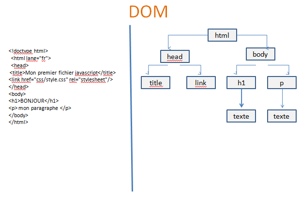

Document Object Model, structure du fichier HTML, il nous permet d'atteindre les différents éléments et de pouvoir agir dessus.

### La sélection d'éléments

Il existe plusieurs façon de sélectionner des éléments:

#### getElementById

Méthode de sélection sur l'objet DOM par l' id.

Vous devriez avoir remarqué qu’on utilise également des points pour accéder au contenu HTML de nos paragraphes et y placer les données souhaitées. En fait, c’est tout simplement parce que document est également un objet prédéfini d’une API (interface de programmation) appelée « DOM » (Document Object Model) que nous allons étudier dans la partie suivante.
Cet objet possède notamment une méthode getElementById() qui nous permet d’accéder à un élément HTML en fonction de son attribut id et une propriété innerHTML qui nous permet d’insérer du contenu entre les balises d’un élément HTML.

Exemples:

    let divUne = document.getElementById("id");
    ->On peut ainsi agir dessus pour lui apporter des modifications:

    divUne.style.backgroundColor = "color";
    divUne.style.padding = "1em";

Remarque: les propriétés CSS qui sont habituellement en plusieurs mots sont transformés en camelCase pour la manipulation JS.

####QuerySelector

Sélecteur plus souple, il permet de sélectionner n' importe quel élément du DOM avec un simple sélecteur CSS.

exemple:

    let divUne = document.querySelector("#id");

    let divUne = document.querySelector("div:nth-child(1)");

####QuerySelectorAll

Sélection de plusieurs éléments en même temps.

Exemple :

    let divs = document.querySelectorAll("div");
Sélection de toutes les div du doc.

###AddEventListener

Sert à ajouter un événement à un élément du DOM.**Un événement est une action de l'user ou du programme**.

    monElement.addEventListener("evenement",functionALancer);

####DOMContentLoaded

Evénement qui se produit quand la page web est chargée, et qui indique que tous les éléments sont prêts, et donc que l'on peut agir sur la page avec  le code JS.

    document.addEventListener('DOMcontentLoaded",function()){
    action
    }   

####Exemple sur les boutons 

    function onClick2(){
    alert("coucou");
    }

    function onClick1(){
        let titre = document.querySelectorAll("h2");
        for(i=0;i<=titre.lenght;i++){
            titre[i].classList.toggle("blue");
        }
    }

    function changerDeCouleur(){
        var maDiv = document.getElementById("id");
        maDiv.classList.toggle("backgroundfonce");
    }

    document.addEventListener("DOMcontentLoaded",function(){
        let button2 = querySelector("#idbutton");
        let button1 = document.getElementById("changerBackground");

        button2.addEventListener("click",onClick1);
        button1.addEventListener("click",changerCouleur);
    })

####RemoveEventListener

Retirer un événement, par exemple désactiver un bouton.

button1.removeEventListener("click",changerCouleur);

Il est important que la fonction de **callback** ainsi que l' événement soient les mêmes que lors de l'ajout.
>En Javascript (est comme c’est le cas dans d’autres langage de programmation), les fonctions sont des entités d’ordre supérieur ou de classe supérieure. De telles fonctions permettent d’abstraire les valeurs et les actions, c’est-à-dire qu’elles peuvent accepter des fonctions en guise d’arguments au même titre que les variables et elles peuvent aussi retourner des fonctions. Une fonctions passée en argument d’une autre fonction est appelée fonction de rappel ou callback function.

###classList

La propriété classList sert à gérer les classes des balises Html
.
Voici quelques-unes de ses méthodes :

- monElement.classList.add("maClasse) -> ajoute une classe
- monElement.classList.remove("maClasse) -> retire une classe
- monElement.classList.toggle("maClasse) -> ajoute ou enlève une classe
- monElement.classList.lenght("maClasse) -> retourne le nombre de classe que l'élément contient  

###Variable this

Dans un gestionnaire d'événement; la variable **this** représente l'objet DOM qui a déclenché l'événement.

Exemple :
On passe la souris sur une div du DOM, le bakground va changer de couleur.
On commence par sélectionner les divs et par leur affecter un événement:

    let divs = document.querySelectorAll("div");
    divs.addEventListener("mouseover",changerText);

Puis on crée la fonction :

    function changerText(){
    this.classList.add("green");
    }
Au sein de la fonction, this représentera uniquement la div sur laquelle nous avons passé la souris,celle qui a déclénché l'événement.

###TextContent

Modifie le contexte textuel d'un noeud du DOM.

Exemple :

    
Hello

    let maDiv = document.getElementById("maDiv");
    alert(maDiv.textContent);
->renvoie hello

    maDiv.textContent = "Bonjour";
->modifie contenu de la div

###InnerHTML

Equivalent de textContent en HTML:
**monElement.innerHTML**.
Contrairement à textContent, il va interpréter le code HTML compris dans la variable.

Exemple:

    monElement.textContent = "<strong>Coucou</strong>
->retourne une valeur qui ne sera pas en gras alors qu'avec innerHTML si.

##Les timers

JavaScript s' exécute sur le navigateur du client et permet d' intéragir vec lui.
Il va donc pouvoir détecter les événements éventuels qui se produisent sur la page.

L'on a vu deux types d' événements : 
- Evénements lancés par la navigateur lui-même:
- - j'ai fini de charger et de lire le HTML (DOMContentLoaded)
- - j'ai fini de charger toute la page et ses dépendances (load)
- Evénements lancés par le client (user):
- - click
- - mouseover...

Nous pouvons intéragir facilement avec ce qu'il se passe sur la page.Mais il manque une notion importante pour compléter ce panel d' événements:
-> comment déterminer le temps qui passe et s' en servie pour lancer des actions?

La gestion du temps en JS, va nous servr à gérer les animations, temporiser des actions...

###SetTimeout et clearTimeout

###setTimeout

Cette méthode va nous permettre de définir un intervalle en millisecondes avant le déclenchement d'une action.

    let timeoutld = window.setTimeout(callBackFunction[,delay,param1,param2,...]);
->paramètres:
- callBackFunction : fonction appelée lors du dépassement de délai. On peut soit fournir une fonction définie ailleurs dans notre code ou une fonction anonyme.
- delay(optionnel) : le délai en millisecondes avant que la fonction callBack soit appelée.Par défaut, vaut 0.**1000ms = 1s**.
- param1,param2 (optionnels) : les paramètres(valeurs) qui seront passés à la fonction callBack.
  
Valeur de retour :
timeoutld : identifiant unique founi par JS?.Si vous souhaitez retrouver et arrêter le timer avant son exécution.

####clearTimeout

Cette méthode permet d' arrêter le timer s'il n'a pas été encore déclenché.

    window.clearTimeout(timeoutld);
->paramètres:
timeoutld

###SetINterval et clearInterval

####setInterval

Méthode qui permet de définir une action qui sera exécutée à intervalles réguliers.

    let intervalID window.setInterval(callbackFunction[,delay,param1,pram2?...]);
->paramètres
- callBackFunction : c'est la fonction qui sera appelée à tous les intervalles déterminés. On peut ici
fournir un nom de fonction défini ailleurs dans notre code ou directement une fonction anonyme
(comme pour toutes les fonctions évènementielles JavaScript qui appellent une fonction de callBack),
- delay (optionnel) : le délai en millisecondes entre chaque intervalles d’exécution de la fonction de
callBack. Par défaut, ce paramètre vaut 0, la fonction est exécutée dès que possible et
continuellement.
- param1, param2... (optionnels) : les paramètres (valeurs) qui seront passés à la fonction de callBack.

Valeur de retour:
timeoutID : un identifiant unique fourni par Javascript si vous souhaitez retrouver et arrêter votre "timer" à tout moment.

####clearInterval

Cette méthode va nous permettre d'arrêter le "timer" à tout moment.

    window.clearInterval(intervalID);

###RequestAnimationFrame et CancelAnimationFrame

####requestAnimationFrame

Cette méthode va nous permettre de définir une action qui sera exécutée au rafraichissement de l'écran.

    let animationID = window.requestAnimationFrame(callBackFunction);
->paramètres:
- callBackFunction : c'est la fonction qui sera appelée au prochain rafraichissement de l'écran. On peut
ici fournir un nom de fonction défini ailleurs dans notre code ou directement une fonction anonyme (comme pour toutes les fonctions évènementielles JavaScript qui appellent une fonction de callBack),

valeur de retour:
animationID : un identifiant unique fourni par Javascript si vous souhaitez retrouver et arrêter votre
demande de rafraichissement à tout moment.

####cancelAnimationFrame

Cette méthode va nous permettre d'arrêter l’exécution du rafraichissement à tout moment.

    window.cancelAnimationFrame(animationID);

>**Mieux comprendre le fonctionnement : les FPS
Alors que setInterval et setTimeout fonctionnent avec un délai en millisecondes, requestAnimationFrame lui va
être exécute à chaque fois que le navigateur fait appel au rafraichissement de l'écran auprès de la machine du
client (rafraichissement assuré en grande parti par le processeur graphique).
Cela signifie que :
• la méthode requestAnimationFrame est plus adapté à la création d'animations fluides,
• le rafraichissement va dépendre de la machine client, en général un écran est rafraichi 60 fois par
seconde, on dit que l'on affiche 60 FPS (frames par seconde),
• le rafraichissement va dépendre aussi du travail demandé au navigateur mais aussi de sa capacité à ce
moment là d'assurer le travail (capacité de l'ordinateur, navigateur plus ou moins utilisé et nombre
d'onglets ouverts), les FPS sont donc variables comme dans les jeux vidéos, mais le rafraichissement
sera effectué quoi qu'il arrive,
• le navigateur va optimiser et préparer le rafraichissement, contrairement à un setInterval, il sait ce
qu'il a à faire au prochain rafraichissement et va le prioriser et l'optimiser,
• le navigateur ne fera l'action de rafraichissement que si l'onglet du navigateur comportant le script est
actif, contrairement à setInterval et setTimeout qui continuerons à être exécutés même si un autre
onglet est actif (donc on optimise la charge du navigateur).
Alors tout ça à l'air magique mais il y a ici une chose que nous ne maitrisons pas c'est le nombre de frames par
seconde (FPS). Il nous faudra ralentir le taux de rafraichissement si nous en avons besoin.**

##Ajax

Ajax (Asynchonous Javascript and XML) est méthode qui permet de rafraîchir une partie de page Web
sans recharger la page complète. Il permet aussi d’afficher dynamiquement des données obtenues en PHP
(exemple des données issues d’une base de données).
Un exemple : Facebook !
Lorsque vous créez une publication, il faut un système qui enregistre votre publication et en même temps
l’affiche sur votre fil d’actualité. Ajax fait ça !
Pour mettre à jour une base de données, de quoi a-t-on besoin ? D’un langage côté serveur (donc php) et
pour rafraîchir la page : d’un langage côté client. Ajax met en relation ces 2 langages !

###Comment fonctionne un appel Ajax :

- L’utilisateur créé un évènement (un clic ou autre)
- Le navigateur envoie sa requête ajax(en jquery) à un script PHP
- Le script PHP fait ce qu’il a à faire (insertion ou consultation de bdd, envoi de mail…)
- Le script PHP renvoie une réponse à l’appli Jquery
- Jquery traite la réponse et l’affiche

###Renvoi d'un appel

Un appel AJAX va renvoyer différents types de données :
- Des données simples (chaînes de texte)  Dans le fichier PHP, nous aurons soit juste du
texte, soit une fonction qui renvoie du texte
- Du html  Du code HTML dans le fichier PHP
- Du Json  Le fichier php renvoie un JSON avec la fonction json_encode()

###Comment fait-on?

Il y a plusieurs façons d’écrire une requête Ajax, la syntaxe en JavaScript pur est assez complexe, la voici :

[OpenClassroom code](https://openclassrooms.com/fr/courses/245710-ajax-et-lechange-de-donnees-en-javascript/244798-lobjet-xmlhttprequest)

## sources

## Exercices dossier exo MM :

- Afficher "Hello World" dans la console du navigateur.
- Déclarer une variable avec le mot-clé let ayant comme nom « color ».Puis, sur la ligne suivante, lui assigner la valeur « rouge ».
- Déclarer une variable « msg » avec le mot-clé `const` en lui assignant une valeur de votre choix, telle qu'un message ou un nombre.Afficher la valeur de cette variable dans la console du navigateur.
- Déclarer une variable ayant pour type String.Afficher la valeur de cette variable dans la console du navigateur.
- Déclarer une variable `x` dont la valeur est égale à `66`. Déclarer une variable `y` dont la valeur est égale à `12`.Déclarer une variable `result` dont la valeur est égale à la somme de `x`et `y`.Afficher la valeur de la variable `result` dans la console du navigateur.
- projet - hello you Hello You
Nous allons construire ensemble un programme capable de vous saluer avec votre prénom. Pour cela, nous allons d'aboir devoir apprendre à interagir avec l'utilisateur.
window.prompt. Jusqu'à maintenant, nous ne connaissons qu'une seule fonction : console.log. Apprenons-en une deuxième : const userAge = window.prompt("Quel âge avez-vous ?");
console.log(userAge);
Si vous exécutez cette instruction, votre navigateur va ouvrir une petite fenêtre avec un champ de texte en vous posant cette question « Quel âge avez-vous ? » Vous allez entrer par exemple « 22 » dans le champ, valider, et la console affichera alors "22".window.prompt a pour fonction de demander quelque chose à l'utilisateur, et de renvoyer la réponse ainsi reccueillie sous forme de String. Ici nous stockons directement cette valeur de retour dans la variable userAge pour ensuite l'afficher.
window.prompt renvoie toujours, toujours une String. Même si l'utilisateur entre le nombre 12, window.prompt renverra en fait la chaîne "12".
Cette information aura son importance en temps voulu. Vous n'en aurez pas besoin pour cet exercice.
Nous voulons un programme qui demande à l'utilisateur son prénom, disons par exemple « Jacques », pour ensuite afficher dynamiquement dans la console "Salut Jacques !".
Petit indice : vous allez avoir besoin de concaténer des Strings.
Bonus 1:
Notre programme va désormais demander à l'utiliseur son prénom, son nom de famille et son année de naissance. Nous afficherons ensuite dans la console la phrase suivante : "Salut Jacques Dumont, cette année tu 42 ans !"
Afin de calculer l'âge de l'utilisateur, vous allez avoir besoin d'effectuer un calcul à partir de l'année. Pour ce bonus, vous êtes autorisés à la spécifier en dur dans le code, sans forcément chercher à la dynamiser. Par exemple, en 2021, vous pourrez simplement déclarer une variable const currentYear = 2023;.
- Date du jour. Afficher dynamiquement la date du jour en Html sous la forme de nous sommes le mardi 23 évrier 2023.
- L' user saisit un montant HT, le résultat TTC s'affiche en HTML.
Il faut réaffciher toutes les informations.Le montant HT est à virgules.
- Énoncé: Créer puis afficher en HTML un objet représentant une voiture :
La marque de la voiture
Son année de fabrication
Sa date d'achat
La liste des passagers (au moins 2), avec le prénom de chacun des passagers
Détails: Afficher les propriétés de l'objet voiture sous la forme d'une liste HTML
On peut représenter n'importe quelle date en JavaScript en donnant une
chaîne de caractères à la création d'une instance de la classe Date :
Représente la date du 5 avril 2014, format américain YYYY-MM-DD. var
myBirthday = new Date('2014-04-05');
Rappels: On peut stocker un objet dans un tableau tout comme on peut stocker un tableau dans un objet...
- Déclarer une variable « colors » contenant les valeurs "Rouge" et "Bleu".Afficher "Bleu" dans la console. En utilisant le tableau, hein!
- Déclarer une variable « colors » contenant un tableau vide.
Puis un second temps, ajouter "Rouge" et "Bleu" à ce tableau.
Enfin, afficher "Rouge" sur la page web, toujours en utilisant le tableau.
- Calculaprompt:
Comment fonctionne une calculatrice ?
On appuie sur des boutons pour construire un calcul, puis on valide, puis la machine nous affiche le résultat du calcul.
On va devoir cliquer sur des boutons ? Non, pas encore. Notre première calculatrice ne sera pas aussi pratique et jolie. Elle sera un peu bancale et malade, mais on va l'aimer quand même, parce qu'elle fonctionnera.
Comment va fonctionner la calculaprompt ?
En demandant à l'utilisateur trois choses d'affilée :
Un premier nombre ;
Un opérateur arithmétique (+, /, +, -) ;
Un second nombre.
Puis, dans la console du navigateur, on affiche un rappel du calcul complet, par exemple 23 / 100.
Puis, toujours dans la console, on affiche le résultat du calcul.
Un exemple pour récapituler le fonctionnement :
L'utilisateur arrive sur la page ;
L'utilisateur entre 6 dans un premier window.prompt ;
L'utilisateur entre * dans un deuxième window.prompt ;
L'utilisateur entre 10 dans un troisième window.prompt ;
La console affiche le calcul 6 * 10 ;
La console affiche le résultat 60 ;

stop : chifoumi , exo3

## Main.js, petits rappels et exercices:

- alert
- window.prompt
- elementToString
- objet date
- typeof
- document.getElementById(id)
- function
- array.splice()

A ajouter :

##Prompt

**Fonction** qui permet de demander à l' utilisateur une information.
Va ouvrir une boîte de dialogue qui contiendra une question et un champ vide de réponse.

Exemple:

    let age = window.prompt("Quel âge avez-vous?");
Pour stocker la valeur saisie par l'User dans une variable, il faut attribuer ce prompt à une variable.
La valeur saisie sera enregistrée dans la variable age.

**Attention, le prompt, renvoie toujours une chaîne de caractères.Ce qui signifie que pour faire des calculs avec cette variable, il va falloir modifier le type de la variable obtenue avec le prompt**.

###Conversion

Les fonctions **parentInt** et **parseFloat** servent à convertir une chaîne de caractères en nombre entier pour le premier, et à virgule pour le second.

exemple :

    age = parseInt(age);
    age ++;
conversion de la var age en type number, et incrémentation possible.

###Objet:

Contexte ne peut être invoqué qu' à l'intérieur de lui même, portée des attributs

Portée des fonctions :

portée des fonctions fléchées
une fonction avec mot clef fontion est accessible depuis l'extérier de l'objet tandis qu'une flechée est cantonnée dans l'objet(locale)

contexte de l'objet : si je suis dans l'objet classe, avec attributs: outerWidth, écran, bureaux,...apprenant.
a l'intérieur de l'objet dans les accolades this dans le contexte.A l'extérieur de l'objet
var apprenant = {
    nom : "Doe",
    prenom : "John",
    age: 30,
    nom: console.log(this.nom)
    //comprend qu'on parle du contexte, pour fonctionner il faut lui donner un  nom, c'est un attribut
};
var apprenant = {
    nom : "Doe",
    prenom : "John",
    age: 30,
    clog: function(){
        console.log(this.nom)
//function pseudo anonyme pas de nom car a déjà un nom d'attribut : clog
    }
};
console.log(apprenant.clog);
//console.log de console.log ko =>return
var apprenant = {
    nom : "Doe",
    prenom : "John",
    age: 30,
    clog: function(){
        return (this.nom)
    }
};

*/

// var apprenant = {
//     nom : "Doe",
//     prenom : "John",
//     age: 30,
//     clog:{
//         ap : this.nom
//     }
// };
// console.log(apprenant);

// apprenant.clog();
// =>appel de la fonction

// var apprenant = {
//     nom : "Doe",
//     prenom : "John",
//     age: 30,
//     clog : () => {
//         console.log(this.nom);
//     }
// };
// apprenant.clog();
//ko portée locale

Accesseurs getter
mutateur seter

accesseur []

maVoiture.fabricant = 'ford';
maVoiture["fabricant"] = 'ford'; chaine de cara qui est setée, plus facile  à manipuler
On peut aussi définir ou accéder à des propriétés JavaScript en utilisant une notation avec les crochets (voir la page sur les accesseurs de propriétés pour plus de détails). Les objets sont parfois appelés « tableaux associatifs ». Cela peut se comprendre, car chaque propriété est associée avec une chaîne de caractères qui permet d'y accéder. Ainsi, par exemple, on peut accéder aux propriétés de l'objet maVoiture de la façon suivante.
Cela rappelle les tableaux associatifs.
Le nom d'une propriété d'un objet peut être n'importe quelle chaîne JavaScript valide (ou n'importe quelle valeur qui puisse être convertie en une chaîne de caractères), y compris la chaîne vide. Cependant, n'importe quel nom de propriété qui n'est pas un identifiant valide (par exemple si le nom d'une propriété contient un tiret, un espace ou débute par un chiffre) devra être utilisé avec la notation à crochets. 

monObj.type              = "Syntaxe point";
monObj["date created"]   = "Chaîne avec un espace";
monObj[str]              = "Une valeur qui est une chaîne";
monObj[rand]             = "Nombre aléatoire";
monObj[obj]              = "Objet";
monObj[""]               = "Une chaîne vide";

regle
expression
regex echappement \ 
regular expression

new = instance
avec objt natif: obj propre au langage utilisé
obj globaux propre au syst d' exploitation ex: os(opérateur système)

Cette notation s'avère également utile quand les noms des propriétés sont déterminés de façon dynamique (c'est-à-dire qu'on ne sait pas le nom de la propriété avant l'exécution). 

// on crée quatre variables avec une même instruction
let monObj = new Object();
let str = "maChaîne";
let rand = Math.random();
let obj = new Object();

monObj.type              = "Syntaxe point";
monObj["date created"]   = "Chaîne avec un espace";
monObj[str]              = "Une valeur qui est une chaîne";
monObj[rand]             = "Nombre aléatoire";
monObj[obj]              = "Objet";
monObj[""]               = "Une chaîne vide";

console.log(monObj);
ex:
monObjet{
    a1 : x,
    a2 : y,
    a3 : z
}
monObjet["a" + random]

On notera que les valeurs utilisées entre les crochets sont automatiquement converties en chaînes de caractères grâce à la méthode toString() sauf si ces valeurs sont des symboles (cf. Symbol). 

La notation avec les crochets peut être utilisée dans une boucle for...in afin de parcourir les propriétés énumérables d'un objet. Pour illustrer comment cela fonctionne, on définit la fonction suivante qui affiche les propriétés d'un objet qu'on lui a passé en argument avec le nom associé :

function afficherProps(obj, nomObjet) {
  let resultat = "";
  for (let i in obj) {
    if (obj.hasOwnProperty(i)) {
        resultat += `${nomObjet}.${i} = ${obj[i]}\n`;
    }
  }
  return resultat;
}

objet dans objet :

let maHonda = {
  couleur: "rouge",
  roue: 4,
  moteur: {
    cylindres: 4,
    taille: 2.2
  }
};

constructeur : 

fonctions ne doivent pas commencer par une maj car fonctions qui commencent par maj spnt des constructeurs ou classe

On peut aussi créer des objets d'une autre façon, en suivant deux étapes :

On définit une fonction qui sera un constructeur définissant le type de l'objet. La convention, pour nommer les constructeurs, est d'utiliser une majuscule comme première lettre pour l'identifiant de la fonction.
On crée une instance de l'objet avec new
Pour définir le type d'un objet, on crée une fonction qui définit le nom de ce type et les propriétés et méthodes des instances. Ainsi, si on souhaite créer un type d'objet pour représenter des voitures, on pourra nommer ce type voiture, et il pourra avoir des propriétés pour le fabricant, le modèle et l'année. Pour ce faire, on pourra écrire la fonction suivante :

function Voiture(fabricant, modele, annee) {
  this.fabricant = fabricant;
  this.modele = modele;
  this.annee = annee;
}

On voit ici qu'on utilise le mot-clé this pour affecter des valeurs aux propriétés d'un objet en fonction des valeurs passées en arguments de la fonction.

let maVoiture = new Voiture("Eagle", "Talon TSi", 1993);

// var apprenant = {
//     nom : "Doe",
//     prenom : "John",
//     age: 30,
//     clog : () => {
//         console.log(this.nom);
//     }
// };
// console.log(typeof(apprenant));
// type object

var apprenant = {
    nom : "Doe",
    prenom : "John",
    age: 30,
    clog : () => {
        console.log(this.nom);
    }
};
console.log(apprenant.age);
var apprenant = {
    nom : "Doe",
    prenom : "John",
    "age de-lap": 30,
    clog : () => {
        console.log(this.nom);
    }
};

