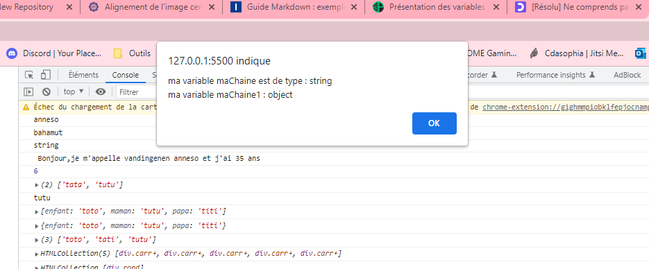
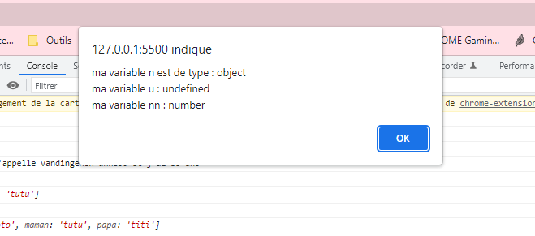
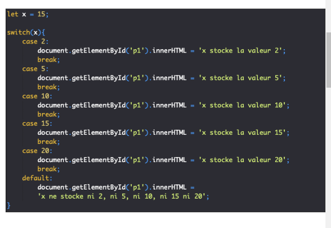

# <div align="center">Cours de JavaScript</div>
## Introduction au JavaScript  
# <div align="center"></div>

>>**JavaScript** est un langage de programmation de scripts principalement employé dans les pages web interactives et à ce titre est une partie essentielle des applications web. Avec les langages HTML et CSS, JavaScript est au cœur des langages utilisés par les développeurs web. Une grande majorité des sites web l'utilisent, et la majorité des navigateurs web disposent d'un moteur JavaScript pour l'interpréter.
JavaScript est aussi employé pour les serveurs Web avec l'utilisation (par exemple) de Node.js ou de Deno.
JavaScript a été créé en 1995 par Brendan Eich et intégré au navigateur web Netscape Navigator 2.0. L'implémentation concurrente de JavaScript par Microsoft dans Internet Explorer jusqu'à sa version 9 se nommait JScript, tandis que celle d'Adobe Systems se nommait ActionScript. JavaScript a été standardisé sous le nom d'ECMAScript en juin 1997 par Ecma International dans le standard ECMA-262. La version en vigueur de ce standard depuis juin 2022 est la 13e édition.
C'est un langage orienté objet à prototype : les bases du langage et ses principales interfaces sont fournies par des objets. Cependant, à la différence d'un langage orienté objets, les objets de base ne sont pas des instances de classes. En outre, les fonctions sont des objets de première classe. Le langage supporte le paradigme objet, impératif et fonctionnel.

<!-- <p align="center">

</p> -->


### Qu'est ce qu'une variable?  

Une variable est un conteneur servant à stocker des informations de manière temporaire, comme une chaine de caractères (un texte) ou un nombre par exemple.

Le propre d’une variable est de pouvoir varier, c’est-à-dire de pouvoir stocker différentes valeurs au fil du temps et c’est cette particularité qui les rend si utiles.

Notez bien déjà qu’une variable en soi et la valeur qu’elle va stocker sont deux éléments différents et qui ne sont pas égaux. Encore une fois, une variable n’est qu’un conteneur. Vous pouvez imaginer une variable comme une boite dans laquelle on va pouvoir placer différentes choses au cours du temps.


### Les règles de déclaration des variables en JavaScript

Une variable est donc un conteneur ou un espace de stockage temporaire qui va pouvoir stocker une valeur. Lorsqu’on stocke une valeur dans une variable, on dit également qu’on assigne une valeur à une variable.

Pour pouvoir utiliser les variables et illustrer leur intérêt, il va déjà falloir les créer. Lorsqu’on crée une variable en JavaScript, on dit également qu’on « déclare » une variable.

Pour déclarer une variable en JavaScript, nous allons devoir utiliser le mot clef var ou le mot clef let (nous allons expliquer la différence entre les deux dans la suite de cette leçon) suivi du nom qu’on souhaite donner à notre variable.

Concernant le nom de nos variables, nous avons une grande liberté dans le nommage de celles-ci mais il y a quand même quelques règles à respecter : 

* Le nom d’une variable doit obligatoirement commencer par une lettre ou un underscore (_) et ne doit pas commencer par un chiffre ;
* Le nom d’une variable ne doit contenir que des lettres, des chiffres et des underscores mais pas de caractères spéciaux ;
*  Le nom d’une variable ne doit pas contenir d’espace.
  
  De plus, notez que le nom des variables est sensible à la casse en JavaScript. Cela signifie que l’usage de majuscules ou de minuscules avec un même nom va permettre de définir des variables différentes. Par exemple, les noms texte, TEXTE et tEXTe vont pouvoir définir des variables différentes.

Enfin, sachez qu’il existe des noms « réservés » en JavaScript. Vous ne pouvez pas utiliser ces noms comme noms pour vos variables, tout simplement car le langage JavaScript les utilise déjà pour désigner différents éléments intégrés au langage. Nous verrons ces différents noms au fil de ce cours.

Vous pouvez également noter qu’on utilise généralement la convention lower camel case pour définir les noms de variable en JavaScript. Cette convention stipule simplement que lorsqu’un nom de variable est composé de plusieurs mots, on colle les mots ensemble en utilisant une majuscule pour chaque mot sauf le premier. Par exemple, si je décide de nommer une variable « monage » j’écrirai en JavaScript let monAge ou var monAge.

```
var maChaine = "exemple";
var maChaine1 = new String("exemple");

alert("ma variable maChaine est de type : " + typeof(maChaine) +
"\nma variable maChaine1 : " + typeof(maChaine1));
```



```
var a = 42;
var b = 4.2;
var c = -42;
var d = "42";

alert("ma variable a est de type : " + typeof(a) +
"\nma variable b : " + typeof(b)+
"\nma variable c : " + typeof(c)+
"\nma variable d : " + typeof(d));
```


```
var n = null;
// objet 
var u = undefined;
var nn = NaN;
// number

alert("ma variable n est de type : " + typeof(n) +
"\nma variable u : " + typeof(u) +
"\nma variable nn : " + typeof(nn));
```



-> La propriété globale NaN est une valeur utilisée pour représenter une quantité qui n'est pas un nombre (Not a Number en anglais).
NaN (Not a Number — pas un nombre) est un type de données numérique qui indique une valeur indéfinie ou une valeur qui ne peut pas être représentée, en particulier le résultat d'une opération à virgule flottante.

-> Chaine de caractère entre doubles côtes.


### Déclarer une variable :

```
let prenom;
var prenom;
```
Les variables sont **déclarées** (crées) mais ne stockent aucune valeur.


### Initialiser une variable :

Lorsqu’on assigne une valeur pour la première fois à une variable, c’est-à-dire lorsqu’on stocke une valeur dans une variable qui n’en stockait pas encore, on dit également qu’on **initialise** une variable.

On va pouvoir initialiser une variable après l’avoir déclarée ou au moment de sa déclaration. Les deux façons de faire sont équivalentes en termes de résultat mais il est plus rapide (en termes d’écriture de code) d’initialiser une variable lors de sa déclaration puisque cela nous va nous éviter d’avoir à réécrire le nom de la variable.

**Pour initialiser une variable, on utilise l’opérateur = qui est dans ce cas non pas un opérateur d’égalité mais un opérateur d’assignation ou d’affectation comme ceci :**

```
let prenom = "anneso";
```
-> déclaration et initialisation en même temps.


```
let prenom;
let prenom = "anneso";
```
-> Déclaration, puis initialisation variable.

>>Opérateurs d'affectation :
Un opérateur d'affectation affecte une valeur à son opérande gauche selon la valeur de son opérande droit. L'opérateur d'affectation simple est le signe égal **(=)**, qui affecte la valeur de son opérande droit à son opérande gauche. Autrement dit, x = f() est une expression d'affectation qui affecte la valeur de f() à x.
Ce point est un point très important à retenir pour éviter les confusions futures et donc je le répète : le signe = ne possède pas du tout la même signification que le « égal » mathématique que vous utilisez dans la vie de tous les jours.
Ici, c’est un opérateur d’affectation. Il sert à indiquer qu’on affecte (ou « assigne » ou encore « stocke ») la valeur à droite du signe dans le conteneur à gauche de celui-ci. Encore une fois, la variable n’est pas « égale » à sa valeur.

>>Vous pouvez également noter deux autres choses intéressantes dans le code ci-dessus : tout d’abord, vous pouvez voir que le mot clef let (ou var) n’est utilisé et ne doit être utilisé que pour déclarer une variable. Lorsqu’on manipule une variable ensuite, on se contente d’utiliser son nom.

>>Ensuite, vous remarquez qu’on utilise des apostrophes droits ou guillemets simples pour entourer la valeur « Pierre » mais pas pour la valeur « 29 ». Cela est dû au fait que « Pierre » est une valeur textuelle tandis que « 29 » est un chiffre et ces valeurs ne vont pas pouvoir être manipulées de la même façon en JavaScript.


### Modifier valeur dans variable : 

Le propre d’une variable et l’intérêt principal de celles-ci est de pouvoir stocker différentes valeurs.

Pour affecter une nouvelle valeur dans une variable déjà initialisée, on va se contenter d’utiliser à nouveau l’opérateur d’affectation =.

En faisant cela, la nouvelle valeur va venir écraser l’ancienne valeur stockée qui sera alors supprimée.
Ici, on commence par stocker la valeur « Pierre » dans notre variable prenom puis on affecte ensuite la valeur « Mathilde » à notre variable. Cette nouvelle valeur vient écraser l’ancienne car une variable ne peut stocker qu’une valeur à la fois = réaffectation valeur.

### La différence entre les mots clefs let et var :

Pourquoi possède-t-on deux mots clefs différents pour déclarer des variables en JavaScript ? Cela provient du fait qu’aucun langage n’est parfait ainsi que du fait que les langages informatiques ne sont pas figés mais sont des langages qui évoluent beaucoup et rapidement.

En effet, en informatique, l’augmentation rapide des possibilités (grâce à des connexions plus rapides et à des matériaux de plus en plus performants) pousse les langages à évoluer et notamment à se complexifier et à développer de nouvelles fonctionnalités pour exploiter ces possibilités.

Cette évolution fait que parfois certains langages changent de philosophie de design et modifient certains de leurs composants lorsque ceux-ci deviennent inadaptés.

En effet, en informatique, vous devez absolument comprendre que tout est toujours en mouvement et que ce qui était vrai ou ce qui était considéré comme une bonne pratique il y a 10, 5, 2 ans en arrière ne l’est potentiellement plus aujourd’hui.

Le problème ici est que les différents langages qui ont passé l’épreuve du temps ne peuvent pas du jour au lendemain abandonner complètement certains composants et en définir de nouveaux complètement différents car cela serait, dans le cas d’une langage populaire comme le JavaScript, dramatique pour le web en général.

Effectivement, il faut ici bien comprendre que lorsqu’on crée un site web, on utilise les technologies du moment. Que se passerait il si certaines fonctionnalités d’un langage étaient brutalement abandonnées et du jour au lendemain plus supportées et donc plus comprises par les navigateurs (dans le cas du JavaScript) qui sont chargées de les exécuter ? La plupart des sites accessibles seraient complètement bogués voire inaccessibles.

Pour cette raison, lorsqu’un langage souhaite faire évoluer ses composants, il doit tenir compte de son héritage et se débrouiller pour faire cohabiter les anciennes fonctionnalités avec les nouvelles au moins le temps que la majorité des propriétaires de sites aient le temps d’implémenter les nouvelles fonctionnalités à la place des anciennes.

Comme vous vous en doutez, dans la plupart des cas, cela prend des années et ce sont généralement dans les faits les navigateurs principaux (Chrome, Firefox, Safari, Explorer) qui « décident » de quand une fonctionnalité est obsolète et qui décident qu’à partir de telle date elle ne sera plus supportée.

Ainsi, la coexistence des mots clefs var et let en JavaScript est due avant tout à ce souci d’héritage du langage.

Pour être tout à fait précis, lorsque le JavaScript a été créé et jusqu’à il y a quelques années, nous n’avions accès qu’au mot clef var qu’on devait utiliser pour déclarer nos variables.

Finalement, les créateurs du JavaScript ont fini par penser que le mot clef var pouvait porter à confusion et ont créé un nouveau mot clef pour déclarer les variables : le mot clef let.

En même temps qu’un nouveau mot clef a été créé, les créateurs du JavaScript en ont profité pour résoudre quelques problèmes liés à la déclaration de variables en utilisant var, ce qui fait que let ne va pas nous permettre de créer des variables de la même façon que var.

Il existe 3 grandes différences de comportement entre les variables déclarées avec var et avec let que nous allons illustrer immédiatement.

**La remontée ou « hoisting » des variables**
Lorsqu’on utilise la syntaxe avec var, on n’est pas obligé de déclarer la variable avant de la manipuler dans le code, on peut très bien effectuer des manipulations en haut du code et la déclarer en fin de code.

Cela est possible car le JavaScript va traiter les déclarations de variables effectuées avec var avant le reste du code JavaScript. Ce comportement est appelé remontée ou hoisting.

Ce comportement a été jugé comme inadapté dans les versions récentes de JavaScript et a donc été corrigé dans la déclaration de variables avec let : les variables utilisant la syntaxe let doivent obligatoirement être déclarées avant de pouvoir être utilisées.

Le but de ce comportement est de pousser les développeurs à créer des scripts plus compréhensibles et plus clairs en apportant de la structure au code avec notamment la déclaration des différentes variables au début de chaque script.

```
prenom = "pierre";
var prenom;
ok
prenom = "pierre";
let prenom;
ko
```

**La redéclaration de variables**
Avec l’ancienne syntaxe var, on avait le droit de déclarer plusieurs fois une même variable en utilisant à chaque fois var (ce qui avait pour effet de modifier la valeur stockée).

La nouvelle syntaxe avec let n’autorise pas cela. Pour modifier la valeur stockée dans une variable avec la nouvelle syntaxe, il suffit d’utiliser le nom de la variable et de lui affecter une autre valeur.

Cette décision a été prise une nouvelle fois pour des raisons de clarté et de pertinence du code. En effet, il n’y a aucun intérêt à redéfinir une même variable plusieurs fois.

**La portée des variables**
La « portée » d’une variable désigne l’endroit où cette variable va pouvoir être utilisée dans un script. Il est un peu tôt pour vous expliquer ce concept puisque pour bien le comprendre il faut déjà savoir ce qu’est une fonction.

Nous reparlerons donc de cette portée des variables lorsque nous aborderons les fonctions en JavaScript.

Vous pouvez pour le moment retenir si vous le souhaitez que les variables déclarées avec var et celles avec let au sein d’une fonction ne vont pas avoir la même portée, c’est-à-dire qu’on ne va pas pouvoir les utiliser aux mêmes endroits.

La syntaxe de déclaration des variables avec let correspond à la nouvelle syntaxe. La syntaxe avec var est l’ancienne syntaxe qui est vouée à disparaitre.

**Vous devriez donc aujourd’hui toujours utiliser le mot clef let pour déclarer vos variables et c’est le mot clef qu’on utilisera dans ce cours.**

### Opérateurs mathématiques 

```
var x = 32;
var y = 5;
var z = 2;

alert(
    y*z
);
alert(
    y/z
);
alert(
    y+z
);
alert(
    y-z
);
alert(
    y%z
);
<!-- modulo reste div, entier qui reste -->
alert(
    y+z*x
);
<!-- différent de : -->
alert(
    (y+z)*x
);
<!-- Attention aux priorités -->
alert(
    y
);
<!-- y= 5 -->
y = y*z
alert(
    y
);
<!-- y=10 réaffectation ou écrasement valeur var y -->

y = y+z
équivaut
y+= z

y = y-z
équivaut
y-= z

y = y*z
équivaut
y*= z

y = y+z
équivaut
y/= z

y = y%z
équivaut
y%= z

<!-- alert(y) donnera le total de toutes les réaffectations précédentes  => y = 0 -->

```

**Différents types principaux d'opérateurs :**

- Logique
- Arithmétique
- Comparaison
  
**Différence entre == et ===**

Comparaison en plus du rapport d'égalité, du type:

```
5+2==7 comparaison valeur
5+2===7 comparaison valeur et type // true
5+2==="7" comparaison valeur et type // false car type string
```

=== renvoie à un booléen : true or false 

```
5+2!=7 false car ==
5+2!==7 false car number
5+2!=="7" true car number/string
```


vrai & vrai : vrai
vrai ou vrai : vrai
vrai & faux : faux
vrai ou faux : vrai

```
if(5+2==7){
  alert("ok");
}
<!-- renvoie ok car vrai -->

if(5+2==7 && 5+3==7){
  alert("ok");
}
<!-- ne renvoie rien car les deux ne sont pas vrais -->

if(5+2==7 || 5+3==7){
  alert("ok");
}
<!-- renvoie ok car une des deux est vraie -->
<!-- || altgr 6 -->
```

else = sinon

``` 
if(5+2==7 && 5+3==7){
  alert("ok");
}
else
{
  alert("pas ok");
}

```

--> if else peut être simplifié avec condition ternaire 
```
 if(heureactuelle<=12){
        alert("Bienvenue c'est le matin");
    }
    else{
        alert("Bienvenue c'est l' après-midi");
    }
    peut devenir 

  (heureactuelle<=12)? question
    alert("Bienvenue c'est le matin");  vrai 
    :
    alert("Bienvenue c'est l' après-midi"); faux 
   
```

|<span style='color:green'>Opérateur de comparaison</span>  | <span style='color:green'>Définition</span> |
|:---------:|:-----------:|
|==	| Permet de tester l’égalité sur les valeurs. Notez que notre « égal » mathématique (l’égalité en termes de valeurs) se traduit en JavaScript par le double signe égal ==. |
|===	| Permet de tester l’égalité en termes de valeurs et de types |
|!=	| Permet de tester la différence en valeurs |
|<>| Permet également de tester la différence en valeurs |
|!==	| 	Permet de tester la différence en valeurs ou en types |
|<| Permet de tester si une valeur est strictement inférieure à une autre|
|> | Permet de tester si une valeur est strictement supérieure à une autre|
|<= | Permet de tester si une valeur est inférieure ou égale à une autre|
|>=	| Permet de tester si une valeur est supérieure ou égale à une autre|


|<span style='color:green'>Opérateur arithmétique</span>  | <span style='color:green'>Définition</span> |
|:---------:|:-----------:|
|+	| Addition |
|-	| Soustraction|
|*	| Multiplication |
|/| Division |
|%| Modulo (reste d’une division euclidienne)|
|**| Exponentielle (élévation à la puissance d’un nombre par un autre)|


### Switch

A une valeur par défaut.
L’instruction switch va nous permettre d’exécuter un code en fonction de la valeur d’une variable. On va pouvoir gérer autant de situations ou de « cas » que l’on souhaite.
En cela, l’instruction switch représente une alternative à l’utilisation d’un if…else if…else.
Cependant, ces deux types d’instructions ne sont pas strictement équivalentes puisque dans un switch chaque cas va être lié à une valeur précise. En effet, l’instruction switch ne supporte pas l’utilisation des opérateurs de supériorité ou d’infériorité.

Dans certaines (rares) situations, il va pouvoir être intéressant d’utiliser un switch plutôt qu’un if…else if…else car cette instruction peut rendre le code plus clair et légèrement plus rapide dans son exécution.

Dans tous les cas, il est bon de savoir à quoi ressemble un switch puisque c’est une structure de base commune à de nombreux langages de programmation et cela vous permettra donc de pouvoir comprendre certains codes utilisant ce genre de structure.

```
var note = x;

// switch (key) = note 

switch(x){
    case 5:
        alert("Votre note est de 5");
        break;
    default:
        ("Nous ne connaissons pas votre note");
}

// un cas un break 
```


Valeur stricte,La première chose à noter ici est qu’on doit fournir une variable sur laquelle on va « switcher ».

Ensuite, l’instruction switch va s’articuler autour de case qui sont des « cas » ou des « issues » possibles. Si la valeur de notre variable est égale à celle du case, alors on exécute le code qui est à l’intérieur.

Chaque case d’un switch doit se terminer par une instruction break. Cette instruction indique au JavaScript qu’il doit sortir du switch.

Sans break, le JavaScript continuerait à tester les différents autres case du switch même si un case égal à la valeur de la variable a été trouvé, ce qui ralentirait inutilement le code et pourrait produire des comportements non voulus.

Enfin, à la fin de chaque switch, il convient d’indiquer une instruction default. Le default est l’équivalent du else des conditions vues précédemment : il sert à gérer tous les autres cas et son code ne sera exécuté que si aucun case ne correspond à la valeur de la variable.

Pas la peine d’utiliser une instruction break au sein de default puisque default sera toujours placée en fin de switch. Si le JavaScript arrive jusqu’au default, alors il sortira ensuite naturellement du switch puisque celui-ci ne contient plus aucun code après default.

Encore une fois, le switch ne présente souvent pas de réel intérêt par rapport à l’utilisation d’une condition classique en dehors du fait qu’utiliser un switch peut dans certains cas réduire le temps d’exécution d’un script et que cette structure est parfois plus claire qu’un if…else if…else contenant des dizaines de else if.


Switch peut être dans If mais pas l'inverse.

### Les tableaux

Les variables de type Array, ou variables tableaux, sont des variables particulières qu’on retrouve dans de nombreux langages de programmation et qui permettent de stocker plusieurs valeurs à la fois avec un système de clef ou d’indice associé à chaque valeur.
En JavaScript, les tableaux sont avant tout des objets qui dépendent de l’objet global Array.

Dans cette nouvelle leçon, nous allons voir de que sont les tableaux et comment définir des tableaux en JavaScript. Nous nous intéresserons ensuite aux propriétés et méthodes de l’objet Array.

**Présentation et création de tableaux en JavaScript**

Les tableaux sont des éléments qui vont pouvoir contenir plusieurs valeurs. En JavaScript, comme les tableaux sont avant tout des objets, il peut paraitre évident qu’un tableau va pouvoir contenir plusieurs valeurs comme n’importe quel objet.

Cependant, dans la plupart des langages, les tableaux ne sont pas des objets mais simplement des éléments de langages spéciaux qui peuvent tout de même contenir plusieurs valeurs.

Le principe des tableaux est relativement simple : un indice ou clef va être associé à chaque valeur du tableau. Pour récupérer une valeur dans le tableau, on va utiliser les indices qui sont chacun unique dans un tableau.

Les tableaux vont s’avérer très pratique lorsqu’on voudra stocker des listes de valeurs dans une variable et pour pouvoir ensuite accéder à certaines valeurs en particulier.

Notez que dans la majorité des langages de programmation, on distingue deux types de tableaux : les tableaux dont les clefs ou indices sont des chiffres et qu’on appelle tableaux numérotés et les tableaux dont les clefs ou indices sont des chaines de caractères définies par le développeur et qu’on appelle tableaux associatifs.

Le JavaScript ne gère qu’un type de tableau : les tableaux numérotés. Les clefs numériques associées à chaque valeur vont être générées automatiquement. La première valeur d’un tableau va posséder la clef 0, la deuxième valeur possèdera la clef 1, et etc.

On va pouvoir stocker n’importe quel type de valeur en valeurs d’un tableau.

**Création d’un tableau en JavaScript**

Les tableaux ne sont pas des valeurs primitives. Cependant, nous ne sommes pas obligés d’utiliser le constructeur Array() avec le mot clef new pour créer un tableau en JavaScript.

En effet, une syntaxe alternative et plus performante (et qu’on préfèrera donc toujours à la syntaxe new Array()) est disponible en JavaScript et nous permet des créer des tableaux qui vont tout de même pouvoir utiliser les propriétés et méthodes du constructeur Array().

Cette syntaxe utilise les crochets […].

```
// tabl asso sans objet 
var monTableau = [];
monTableau["enfant"] = "toto";
monTableau["maman"] = "tutu";
monTableau["papa"] = "titi";
console.log(monTableau);
// array 

// tabl associatif avec objet 
var monTableau2 = { enfant : "toto",maman : "tutu",papa : "titi"};
console.log(monTableau2);
// objet 

// tab indexé une seule ligne
var monTableau3 = ["toto", "tati", "tutu"];
console.log(monTableau3);

```

**Accéder à une valeur dans un tableau**

Lorsqu’on crée un tableau, un indice est automatiquement associé à chaque valeur du tableau. Chaque indice dans un tableau est toujours unique et permet d’identifier et d’accéder à la valeur qui lui est associée. Pour chaque tableau, l’indice 0 est automatiquement associé à la première valeur, l’indice 1 à la deuxième et etc.

Pour accéder à une valeur en particulier dans un tableau, il suffit de préciser le nom du tableau puis l’indice associé à la valeur à laquelle on souhaite accéder entre crochets.

Dans le cas où un tableau stocke un autre tableau, il faudra utiliser deux paires de crochets : la première paire va mentionner l’indice relatif à la valeur à laquelle on souhaite accéder dans notre tableau de base (c’est-à-dire l’indice lié au sous tableau en l’occurrence, tandis que la deuxième parie de crochets va nous permettre de préciser l’indice lié à la valeur à laquelle on souhaite accéder dans notre sous tableau.

###La fonction Math.random() renvoie un nombre flottant pseudo-aléatoire compris dans l'intervalle [0, 1[ (ce qui signifie que 0 est compris dans l'intervalle mais que 1 en est exclu) selon une distribution approximativement uniforme sur cet intervalle. Ce nombre peut ensuite être multiplié afin de couvrir un autre intervalle. La graine (seed) du générateur est choisie par l'algorithme et ne peut pas être choisie ou réinitialisée par l'utilisateur.
nb flottant  : à virgule


                             


  
